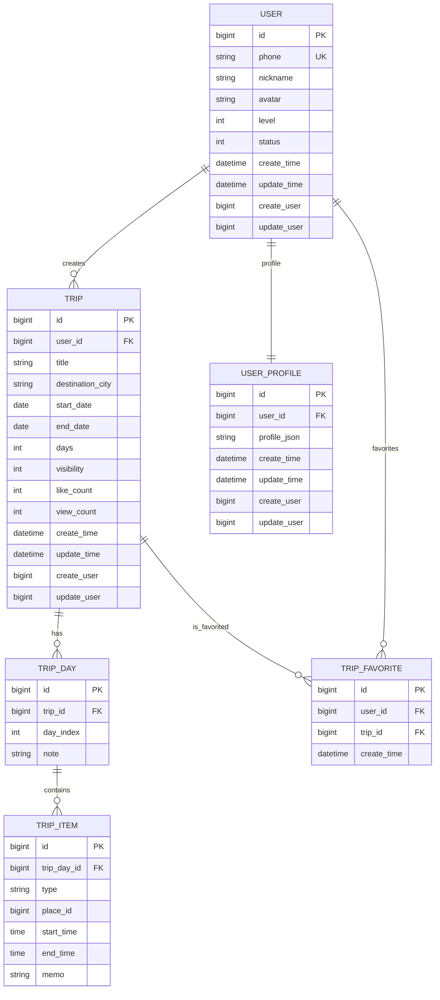

### `@triphub` 实际涉及的表（共 6 张）
- `user`
- `trip`
- `trip_day`
- `trip_item`
- `user_profile`
- `trip_favorite`

### 可直接渲染的 Mermaid ER 图（字段 + 关系）

补充两点和 SQL 一致的约束（Mermaid 里不太好“画出来”但我在这里注明）：
- **`user.phone`** 是唯一索引（`uk_user_phone`）
- **`user_profile.user_id`** 唯一（1:1 画像）
- **`trip_favorite(user_id, trip_id)`** 复合唯一（防止重复收藏）
- **`trip_item.place_id`** 在当前 schema 里**没有对应表**（所以图里只能保留字段，无法画出指向的实体）