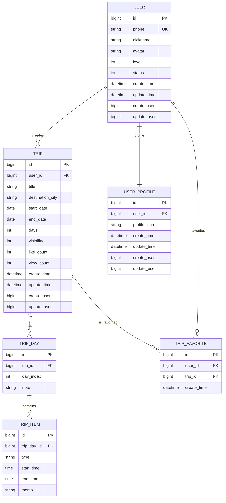

### `@triphub` 实际涉及的表（共 6 张）
- `user`
- `trip`
- `trip_day`
- `trip_item`
- `user_profile`
- `trip_favorite`

### 可直接渲染的 Mermaid ER 图（字段 + 关系）

补充两点和 SQL 一致的约束（Mermaid 里不太好“画出来”但我在这里注明）：
- **`user.phone`** 是唯一索引（`uk_user_phone`）
- **`user_profile.user_id`** 唯一（1:1 画像）
- **`trip_favorite(user_id, trip_id)`** 复合唯一（防止重复收藏）
- 说明：当前版本条目先仅保留 `memo` 作为展示文案，未引入“地点表/POI 表”。

你要我：**基于 TripHub 这 6 张表（`user/trip/trip_day/trip_item/user_profile/trip_favorite`）的设计**，站在面试官角度给出**可能会问的面试题（尽量全面）**，并且为每个问题提供**详细参考答案**。  
我先快速读一下项目里现成的“数据库表说明/行程模块文档”，把问题覆盖到你们真实业务点（缓存、收藏、可见性、计数、并发等），然后再整理成一套面试问答清单。

[4 tools called]

你要我：**围绕 `@triphub` 这 6 张表（`user/trip/trip_day/trip_item/user_profile/trip_favorite`）**，从面试官视角整理**可能会问的数据库相关问题（尽量全面）**，并给出**详细参考答案**。

### 一、表设计与关系（高频基础）
#### 1）这套数据库一共多少张表？各自职责是什么？
- **答案**：6 张。
  - **`user`**：用户主数据（手机号唯一、昵称头像、状态、审计字段）。
  - **`trip`**：行程主表（归属用户、标题、目的地、日期范围、可见性、计数 like/view、审计字段）。
  - **`trip_day`**：行程的“天”维度拆分（`trip_id` + `day_index` + note）。
  - **`trip_item`**：每一天的条目（景点/酒店/交通等），归属 `trip_day`。
  - **`user_profile`**：用户画像 JSON（1 个用户 1 份画像）。
  - **`trip_favorite`**：用户与行程的收藏关系（多对多的中间表）。

#### 2）这些表之间是什么关系？
- **答案**：
  - `user` 1—N `trip`（一个用户可创建多个行程）
  - `trip` 1—N `trip_day`
  - `trip_day` 1—N `trip_item`
  - `user` 1—1 `user_profile`（通过 `user_profile.user_id` 唯一约束）
  - `user` N—M `trip` 通过 `trip_favorite`（并用 `(user_id, trip_id)` 复合唯一防重复收藏）

#### 3）为什么要把 `trip_day` 和 `trip_item` 拆表？不能一个表搞定吗？
- **答案**：拆表是为了**数据模型清晰**和**扩展性**。
  - **结构化层级**：Trip 是“行程”，Day 是“第几天”，Item 是“当天的安排”。层级清晰，避免一个大表塞一堆 nullable 字段。
  - **写入局部化**：修改某一天的 note/条目，不必更新整个行程大字段。
  - **扩展方便**：将来 `trip_day` 可以加住宿城市、当日预算；`trip_item` 可以加排序、花费、经纬度、交通方式等。

#### 4）脚本里为什么没建外键（FOREIGN KEY）？这是不是缺陷？
- **答案（工程取舍）**：不建外键是常见取舍，不一定是错。
  - **好处**：写入/删除更灵活；避免跨表级联导致的“隐式大事务”；高并发下少一些约束检查开销；迁移/分库分表更自由。
  - **代价**：**引用完整性要靠应用保证**（例如不能插入不存在的 `trip_id`；删除 `trip` 要清理 day/item/favorite）。
  - **面试加分点**：说明你会在 Service 层做校验与补偿，并在关键写路径用事务保证一致性。

#### 5）`trip_item.place_id` 指向哪里？为什么库里没 `place` 表？
- **答案**：当前 schema 里确实没有 `place` 表，这意味着：
  - **可能是外部数据源/第三方 POI 服务**的 ID（不在本库管理）。
  - 或者是**后续规划**（未来新增地点表）。
  - **风险**：无法靠 DB 保证引用存在；解决方式是写入时校验、或允许“弱引用”（place 不存在也能保存 memo/type/time）。

---

### 二、约束、索引与查询性能（面试官很爱追问）
#### 6）现有唯一约束有哪些？解决什么问题？
- **答案**：
  - `user.phone` 唯一：防止一个手机号注册多个账号。
  - `user_profile.user_id` 唯一：保证 1 用户只有 1 份画像。
  - `trip_favorite(user_id, trip_id)` 唯一：保证“收藏”天然幂等，避免重复收藏。

#### 7）如果用户重复点“收藏”，数据库层会发生什么？你怎么处理？
- **答案**：会触发复合唯一冲突（duplicate key）。
  - **正确处理**：收藏接口做**幂等**：
    - 插入前先查是否已收藏（读多一次，但语义清晰），或
    - 直接插入，捕获重复键异常并返回“已收藏”（更简单、更抗并发）。
  - **同时要注意**：`trip.like_count` 的更新必须与收藏插入保持一致，避免“插入失败但 like_count +1”。

#### 8）现有索引够用吗？你会补哪些索引？
- **答案**：现有索引偏基础（`trip.user_id`、`trip_day.trip_id`、`trip_item.trip_day_id`、`trip_favorite.trip_id` 等）。
  - 可能要补的（看业务查询）：
    - **发现页/公开列表**：`trip(visibility, view_count)` 或 `trip(visibility, update_time)`（按热度/时间排序分页）。
    - **行程日期过滤**：`trip(user_id, start_date)` 或 `trip(start_date, end_date)`（如果支持按时间范围筛选）。
    - **唯一性补强**：`trip_day(trip_id, day_index)` 建唯一索引，防止同一行程出现两个“第 1 天”。

#### 9）如何高效查“行程详情（含 days + items）”，避免 N+1？
- **答案**：两种常用方式：
  - **一次性 JOIN 拉平再在应用层组装**（单次往返，数据量可能大，注意重复行）。
  - **分两到三次批量查询**（更常用、更稳）：
    - 查 `trip` 1 行
    - 查 `trip_day`（按 `trip_id`）
    - 查 `trip_item`（按 `trip_day_id IN (...)` 批量）
  - **关键**：必须批量 IN，不能每个 day 再查一次 item（那就是 N+1）。

#### 10）`trip_day.day_index` 为什么从 1 开始？如果用户插入/删除中间一天怎么处理？
- **答案**：从 1 开始符合用户认知。
  - 删除中间一天会导致 day_index 不连续，通常两种策略：
    - **允许不连续**（简单，但前端展示要处理）
    - **删除后重排**（需要事务 + 批量 update，注意并发编辑）
  - 面试中要说清楚：**你选哪一种以及为什么**（KISS：允许不连续最简单；如果强业务要求连续再做重排）。

#### 11）`trip_item` 没有显式排序字段，会有什么问题？怎么解决？
- **答案**：只靠 `start_time`/`end_time` 排序会有歧义（同一时间多个点、无时间条目）。
  - **建议**：加 `sort_order` 或 `position`（int），前端拖拽排序只更新该字段。
  - 这是典型“需求一上来就会逼你加字段”的点，面试官常问扩展性。

---

### 三、计数与一致性（你们项目里确实做了优化）
#### 12）为什么 `trip` 里要冗余 `like_count/view_count`？不从收藏表/日志实时统计吗？
- **答案**：实时统计开销大，冗余计数字段是为了**读性能**。
  - `like_count`：从 `trip_favorite` 聚合会很慢（尤其热门行程收藏多）。
  - `view_count`：每次访问都写 DB 会写放大。
  - 代价是**一致性要管理**：用最终一致/异步刷盘/定期校准来兜底。

#### 13）`view_count` 高并发自增怎么做才不会把 DB 打爆？
- **答案（你们的实现思路）**：请求侧只写 Redis 增量，后台定时批量刷回 DB。
  - **优点**：把高频写从 MySQL 转移到 Redis（吞吐高），MySQL 只做批量更新。
  - **一致性**：最终一致；展示时可以叠加 Redis 增量，或接受短暂不准确。
  - **失败场景**：刷盘任务挂了/Redis 丢数据 → 需要补偿或校准。

#### 14）热门榜（`hot:trip` / `hot:dest`）为什么用 Redis ZSet？DB 不行吗？
- **答案**：
  - ZSet 天然支持 **TopN**（`ZREVRANGE`）和 **增量打分**（`ZINCRBY`），非常适合实时热榜。
  - DB 做 TopN 需要聚合/排序，成本高；并发写也更重。
  - **代价**：需要容灾/重建策略（你们有定期从 DB 重建的思路）。

---

### 四、事务边界与并发（面试官最爱挖坑）
#### 15）“收藏/取消收藏”这条链路哪些操作必须放在一个事务里？
- **答案**：至少要保证数据库层面的核心一致性。
  - **收藏**：插入 `trip_favorite` + 更新 `trip.like_count`（同一事务，避免只成功一半）。
  - **取消收藏**：删除 `trip_favorite` + `like_count - 1`（同一事务）。
  - 缓存删除、画像异步更新可以不强事务（可最终一致）。

#### 16）如果两个人同时收藏/取消，`like_count` 会错吗？怎么保证？
- **答案**：如果用 `UPDATE trip SET like_count = like_count + 1 WHERE id = ?` 这种**原子自增**，并发下不会丢更新。
  - 真正难的是“收藏表插入是否成功”与“计数更新”要一致，所以要事务或在失败时补偿回滚。

#### 17）为什么要“写 DB 成功后删缓存”（cache-aside）？不直接更新缓存？
- **答案**：KISS。
  - 直接更新缓存容易写错字段/并发覆盖/维护成本高。
  - cache-aside：写 DB → 删缓存 → 下次读自然重建，简单、可控、符合大多数互联网实践。

---

### 五、画像 JSON（容易被追问“为什么这么存”）
#### 18）`user_profile.profile_json` 用 JSON 的利弊？
- **答案**：
  - **利**：字段可扩展（兴趣/预算/风格/偏好城市等随时加），不频繁改表；更像“文档型画像”。
  - **弊**：难以做复杂 SQL 查询与索引；JSON 内字段统计成本高。
  - **应对**：若要按画像字段检索，可做：
    - 把高频检索字段提升为列（冗余一份），或
    - 用生成列 + 索引（MySQL 支持），或
    - 画像只用于推荐/LLM 上下文，不做强检索。

#### 19）画像怎么和收藏行为联动更新？同步还是异步？
- **答案**：画像属于“增强能力”，一般允许最终一致。
  - 主链路：收藏写入成功 + like_count 更新 + 缓存失效（保证用户立刻看到收藏状态正确）
  - 非关键链路：画像统计（例如偏好城市）可以异步重建，降低接口延迟。

---

### 六、可见性与权限（数据库怎么支撑）
#### 20）`trip.visibility` 怎么设计访问控制？查询时怎么用？
- **答案**：最基本是 0 私有 / 1 好友可见 / 2 公开。
  - 详情查询时要检查：当前用户是否是创建者；若不是创建者则 visibility 必须满足规则。
  - 发现页只查 `visibility = 2` 的公开行程，并结合热榜/分页。

---

### 七、数据生命周期与清理（删除/级联/一致性）
#### 21）删除一个 `trip` 时，`trip_day/trip_item/trip_favorite` 怎么处理？
- **答案**：因为没外键，必须由应用显式处理：
  - **顺序**：先删 item → 删 day → 删 favorite → 删 trip（或反过来，但要确保不会留下孤儿数据）。
  - **事务**：建议同一事务内完成，避免只删了一半。
  - **软删 vs 硬删**：如果要审计/恢复，建议软删（加 deleted 字段）；当前 schema 没有，需要后续扩展。

---

### 八、常见“开放题”（看你工程思维）
#### 22）如果让你改进这套表结构，你会优先改什么？
- **答案（务实优先级）**：
  1. 给 `trip_day(trip_id, day_index)` 加唯一索引（防脏数据）。
  2. 给 `trip_item` 加 `sort_order`（满足拖拽排序/无时间条目）。
  3. 针对发现页补充组合索引（按 visibility + 排序字段）。
  4. 如果 place 真要本地化：补 `place` 表或明确它是外部 ID，并在接口层校验。

#### 23）你怎么向面试官解释“为什么不追求强一致”？
- **答案**：该强一致的地方强一致（收藏关系、权限、主数据），该最终一致的地方最终一致（view_count、热榜、画像统计）。
  - 因为强一致成本高，会拖垮主链路延迟与吞吐；而计数/画像允许短暂误差，对用户体验影响小。

---

如果你愿意，我也可以把这些问题整理成两套版本：  
- **短版（面试速背）**：每题 2～4 句结论  
- **长版（追问展开）**：附典型 SQL、事务边界、索引设计依据、故障场景与补偿策略

你要我：**在前面那一批“基于 TripHub 6 张表的面试题”之外，再补一批面试官可能继续追问的问题，并给出更详细的问答**。  
我会先把你刚才误粘进 `triphub/db/数据库表说明.md` 的聊天内容清理掉（保持文档干净），然后按“SQL/索引/事务并发/一致性与迁移/扩展设计”再补一套更进阶的问答清单。

[5 tools called]

你要我：**除了前面那批问题之外，面试官还会围绕这 6 张表再追问什么（要更全面），并给出详细问答**。下面给你一套“更进阶、更容易被追问到实现细节”的题库（按主题分组，基本都能直接拿去背）。

---

## 一、SQL 能力与查询写法（必考）
### 1）怎么查“某用户收藏的行程列表”，同时返回 `like_count/view_count`，并按收藏时间倒序？
- **答**：典型中间表查询，用 `trip_favorite` 驱动，再 join `trip`。
- **SQL**（思路）：
  - `FROM trip_favorite f JOIN trip t ON f.trip_id=t.id WHERE f.user_id=? ORDER BY f.create_time DESC LIMIT ?,?`
- **索引点**：
  - `trip_favorite` 需要 `(user_id, create_time)` 或至少 `user_id`，否则按用户查会扫全表。
  - 当前有 `(user_id, trip_id)` 唯一索引，但**不保证**能高效按 `create_time` 排序（可考虑加联合索引）。

### 2）怎么查“行程某一天的条目”，保证顺序稳定？
- **答**：不能只按 `start_time`，因为可能 `NULL` 或相同时间；要加第二排序键（比如 `id` 或未来的 `sort_order`）。
- **SQL**：`WHERE trip_day_id=? ORDER BY start_time ASC, id ASC`

### 3）怎么查“行程详情 + day + item”避免 N+1？
- **答**：两段/三段批量查最稳：
  1) 查 `trip`
  2) 查 `trip_day`（按 `trip_id`）
  3) 查 `trip_item`（按 `trip_day_id IN (...)`）
- **理由**：JOIN 一把梭会产生重复行，数据放大，应用层组装复杂；批量查更可控。

### 4）怎么判断“当前用户是否收藏了该行程”，要求快？
- **答**：用存在性查询即可：
  - `SELECT 1 FROM trip_favorite WHERE user_id=? AND trip_id=? LIMIT 1`
- **索引点**：复合唯一 `(user_id, trip_id)` 正好覆盖，O(logN)。

### 5）发现页想按“最热视频/最新”分页，你会怎么写分页？
- **答**：
  - 小数据量：OFFSET 分页可接受
  - 大数据量：用**游标分页**（seek pagination），比如按 `create_time,id`：
    - `WHERE (create_time,id) < (?,?) ORDER BY create_time DESC,id DESC LIMIT ?`
- **理由**：OFFSET 越大越慢，且并发插入会导致跳页/重复。

---

## 二、索引与性能（追问很凶）
### 6）为什么要给 `trip_day(trip_id, day_index)` 加唯一索引？
- **答**：没有外键/唯一约束时，应用 bug 或并发会插出两个“第 1 天”，数据就坏了；唯一索引是最后一道防线。

### 7）你会给 `trip_item` 加什么索引？
- **答**：核心是按天查：`(trip_day_id, start_time, id)`（或 `(trip_day_id, sort_order)`）。
- **理由**：list 条目是高频读路径，复合索引可以减少回表与排序成本。

### 8）`trip` 表里哪些组合索引最可能需要？
- **答**（看接口）：
  - 我的行程：`(user_id, create_time)`（按时间倒序分页）
  - 发现页公开：`(visibility, create_time)` 或 `(visibility, view_count)`（看你按什么排序）
- **理由**：where + order by 组合是索引设计核心。

### 9）为什么不建议给每个字段都建索引？
- **答**：索引会增加写入成本、占用空间、影响缓存命中；索引要围绕真实查询模式建，不是越多越好。

---

## 三、事务与并发一致性（高频“坑题”）
### 10）“收藏行程”如何保证 `trip_favorite` 与 `trip.like_count` 一致？
- **答**：同一事务内完成：
  1) 插入 `trip_favorite`
  2) `UPDATE trip SET like_count = like_count + 1 WHERE id=?`
- **关键细节**：
  - 插入可能因唯一冲突失败：要么捕获后直接返回成功（幂等），要么先查再插。
  - 如果插入失败，不允许 `like_count` 仍然 +1。

### 11）`like_count` 会不会被并发改错？怎么写 update 才安全？
- **答**：必须用**原子自增**：
  - `SET like_count = like_count + 1`
  - 取消收藏：`SET like_count = GREATEST(like_count - 1, 0)`
- **避免**：先 select 再 set（读改写）会丢更新。

### 12）事务隔离级别怎么选？面试官问“幻读/不可重复读”你怎么答？
- **答**：MySQL InnoDB 默认 `REPEATABLE READ`，配合索引范围锁可避免很多幻读场景。
- **在本项目的选择**：收藏/取消是短事务，默认 RR 通常足够；关键是把“关系表 + 计数更新”放同一事务。

### 13）如何解释“没有外键但也能保证一致性”？
- **答**：
  - **写路径**：Service 层先校验归属关系（例如 trip 属于当前用户），再写入；关键操作用事务。
  - **修复路径**：定期跑一致性修复（你们已经有类似 `ConsistencyReconciliationTask` 的思想），清理孤儿 `trip_day/trip_item` 等。

---

## 四、字段设计与数据类型（细节加分）
### 14）为什么主键用 `BIGINT AUTO_INCREMENT`？有什么利弊？
- **答**：
  - 利：简单、性能好、和 MyBatis-Plus 适配自然
  - 弊：分库分表/多机写入时难合并；暴露 ID 可能被爬（可用雪花 ID 或对外用编码）
- **面试表达**：Demo/单库优先简单；需要横向扩展时再换策略。

### 15）`DATETIME` vs `TIMESTAMP` 怎么选？时区坑怎么讲？
- **答**：
  - `DATETIME` 不带时区语义，存“本地时间”；`TIMESTAMP` 会做时区转换。
  - 项目里一般统一：DB 存 UTC（或明确 server 时区），应用展示再转换，避免跨时区错乱。

### 16）`user` 是 SQL 关键字吗？表名叫 `user` 会不会有坑？
- **答**：在部分数据库/语法里是保留字风险；MySQL 里通常用反引号 `` `user` `` 就能规避。
- **工程建议**：要么坚持全程转义，要么改名 `t_user`/`users` 更稳。

---

## 五、缓存/最终一致（你们项目特点，面试官会借题发挥）
### 17）如果 `view_count` 走 Redis 增量，怎么保证 DB 最终一致？Redis 丢了怎么办？
- **答**：
  - 正常：请求只写 Redis 增量，定时任务批量刷 DB
  - Redis 丢数据：`view_count` 会变小（可接受的话就是最终一致偏差）；不接受就要补偿数据源（日志/埋点）
- **你该怎么讲**：这是典型“吞吐 vs 精确”的取舍，选择可解释、可补偿的方案。

### 18）缓存与 DB 不一致时，优先信哪个？
- **答**：
  - 业务主数据（标题、可见性）优先信 DB，缓存只是加速层
  - 计数（view/hot）允许偏差，可最终一致
- **落地方式**：写后删缓存（cache-aside），读时重建。

---

## 六、演进与迁移（真正的工程题）
### 19）如果要从现在的 schema 演进（比如加排序字段/加唯一索引），怎么做线上迁移？
- **答**：
  - 先加字段（nullable，带默认值）
  - 双写/兼容读一段时间
  - 回填历史数据（批处理）
  - 最后加非空/约束、切换逻辑、清理旧字段
- **关键点**：分阶段，避免长锁表；用 online DDL 能力（MySQL 版本相关）。

### 20）你刚刚删了 `trip_item.place_id`，存量环境怎么处理？
- **答**：执行一次：
  - `ALTER TABLE trip_item DROP COLUMN place_id;`
- **风险提示**：如果线上已有代码仍在写 `place_id` 会报错，所以必须先发代码再做 DDL（或先做兼容字段保留一段时间）。

---

如果你想再“更全面”一点，我也能按**岗位级别**给你分层（初级/中级/高级）各 30 题，并把每题的“追问点”和“容易答错点”也列出来。