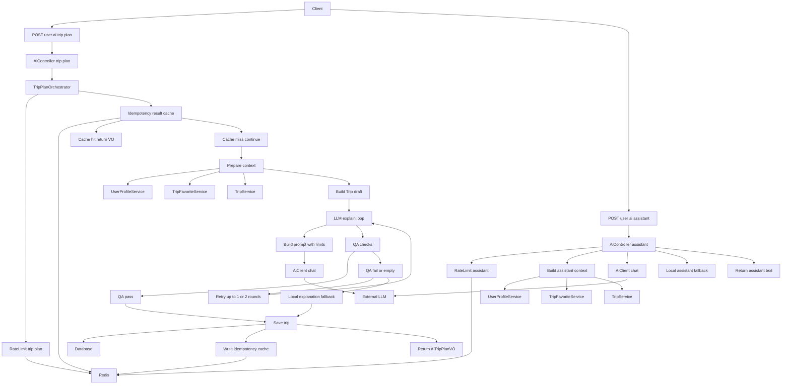

### 需求回顾
本模块用于 **AI 行程规划 / 助手**：
- **画像 + 最近收藏** 作为上下文
- 通过 **外部 LLM** 生成“解释文案”（自然语言）
- 关键组件：`TripPlanOrchestrator`（限流 + 幂等结果缓存 + 多轮 QA + 本地降级）、`AiClient`

---

### 最终设计说明（已按 KISS 简化）
本次简化明确砍掉三类“可能过度”的保护，避免系统变复杂：
- **砍掉 AiClient 的熔断 + bulkhead + 退避 jitter**：保留 **超时 + 可选重试（0~1 次）**。
- **砍掉幂等 fingerprint（key 复用冲突检测）**：不再校验“同 key 不同请求”的冲突。
- **砍掉并发幂等锁 + 轮询等待结果**：不做 SETNX lock，不做 poll；仅保留“命中结果缓存直返”。

说明：这些能力不是“错”，只是面向生产更高并发/更差外部稳定性时的增强项；需要时可以再加回来。

---

### 组件职责（KISS）
- **`AiController`**
  - `/user/ai/trip-plan`：调用 `TripPlanOrchestrator`
  - `/user/ai/assistant`：轻量编排（做用户维度限流 + 失败本地降级）
- **`TripPlanOrchestrator`**
  - **限流**：`SimpleRateLimiter`（Redis 固定窗口计数）
  - **幂等（简化版）**：只做 **userId 绑定的结果缓存命中直返**
  - **多轮生成 + QA**：最多 1~2 轮（冷启动 1，否则 2）
  - **本地降级**：LLM 不可用或 QA 不通过时，生成确定性的兜底解释
- **`AiClient`**
  - **单例 HTTP 客户端**：Java 17 `HttpClient`（连接复用）
  - **超时**：connect/request timeout
  - **有限重试**：仅对 429/5xx/timeout（默认 1 次；也可配成 0）
  - **可观测性**：记录调用次数/耗时/错误类型（Micrometer）；日志只记录大小与耗时，不打完整 prompt

---

### 模块详细流程（Mermaid）
尽量保持语法稳：少符号、短 label，避免不同渲染器不兼容。

---

### 关键实现点（简化后）
- **幂等键语义（简化版）**
  - 结果缓存 key：`ai:idemp:trip-plan:res:{userId}:{Idempotency-Key}`（TTL 10 分钟）
  - 若命中缓存：直接返回 `AiTripPlanVO`，本次不调用外部 LLM
- **Prompt 治理（仍保留）**
  - 画像/收藏做长度裁剪
  - 收藏标题截断（避免单字段撑爆 prompt）
- **QA 与降级（仍保留）**
  - QA：长度上下限、必须提及城市、拒绝明显格式化/注入痕迹
  - 降级：仅引用本地确定性信息，保证“可读但不胡说”

---

### 相关配置
在 `application.yml` 下的 `triphub.ai`：
- `base-url` / `api-key` / `model`
- `connect-timeout-ms` / `request-timeout-ms`
- `max-retries`（建议默认 1；若想更 KISS 可以配置为 0）

---

### 面试官可能问到的问题与参考答案（基于“简化后的最终设计”）
- **Q：这个模块解决了什么问题？**
  - **A：**用用户画像与最近收藏做上下文，调用外部 LLM 生成“解释文案”，并创建一条 Trip；同时提供一个轻量 assistant 文本建议入口。

- **Q：为什么需要编排器 `TripPlanOrchestrator`，Controller 直接调 LLM 不行吗？**
  - **A：**外部 LLM 是不可靠依赖且成本高，需要统一处理限流、幂等缓存、多轮/QA/降级；把这些集中在编排器里，Controller 保持薄。

- **Q：画像/收藏是怎么拼到 prompt 里的？**
  - **A：**画像 JSON 解析成 Map，再序列化为 JSON 文本；收藏取最近 N 条行程摘要（tripId/title/city/days）序列化为 JSON，一起写入 user prompt。

- **Q：为什么要做 prompt 长度裁剪？**
  - **A：**避免 prompt 膨胀导致延迟/费用上涨，并降低噪声与隐私暴露；裁剪是低成本且收益很高的工程约束。

- **Q：限流怎么做？为什么不用令牌桶？**
  - **A：**Redis 固定窗口计数（INCR+EXPIRE），实现简单、可解释、能防刷；算法精度不是当前阶段的核心矛盾，先保证不会把外部 LLM 打爆。

- **Q：幂等做了什么？为什么“简化版”还保留 userId 绑定？**
  - **A：**客户端带 `Idempotency-Key` 时，用 `userId+key` 作为结果缓存 key；命中直接返回，避免重复外呼/重复扣费；userId 绑定是数据隔离底线，避免跨用户串单。

- **Q：为什么砍掉 fingerprint/并发锁？会带来什么问题？**
  - **A：**这是面向更复杂生产场景的增强。砍掉后可能出现：
    - 同一个 key 被复用到不同请求：可能返回旧结果（风险由前端约束承担）
    - 同 key 并发重复点击：可能重复外呼一次（成本上升，但逻辑仍正确）
    当前阶段以 KISS 为主，若线上观察到问题再加回去即可。

- **Q：多轮与 AiClient 重试的区别是什么？**
  - **A：**AiClient 重试解决“网络/对端状态”类失败（429/5xx/timeout）；多轮解决“内容质量”类失败（空结果/QA 不通过）。两者关注点不同。

- **Q：QA 在做什么？为什么不做很复杂的校验？**
  - **A：**只做低成本 sanity check：长度上下限、必须提及城市、拒绝明显注入/格式化痕迹。复杂 QA 会引入大量规则与误伤，性价比低，必要时再演进为结构化输出+schema 校验。

- **Q：外部 LLM 不可用时怎么保证可用性？**
  - **A：**`trip-plan` 用本地模板生成兜底解释并照常创建 Trip；`assistant` 返回本地兜底建议文本，避免接口完全失败。

- **Q：你们怎么做可观测性？**
  - **A：**记录调用次数（success/fail/skipped）、耗时；日志只记录 prompt/response 的字节大小和耗时，不记录完整 prompt，避免隐私泄露。

- **Q：如果将来并发上来了，你会把哪些能力加回来？**
  - **A：**按症状加：
    - 频繁重复点击/重放导致成本上升：加并发幂等锁（SETNX）与短轮询
    - 429/对端抖动：加退避+jitter
    - 线程堆积/外部不稳定：加 bulkhead 与熔断
