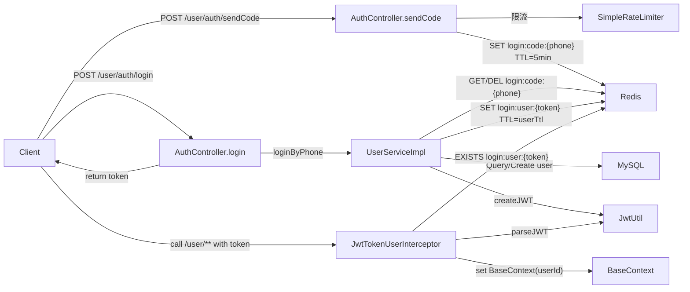
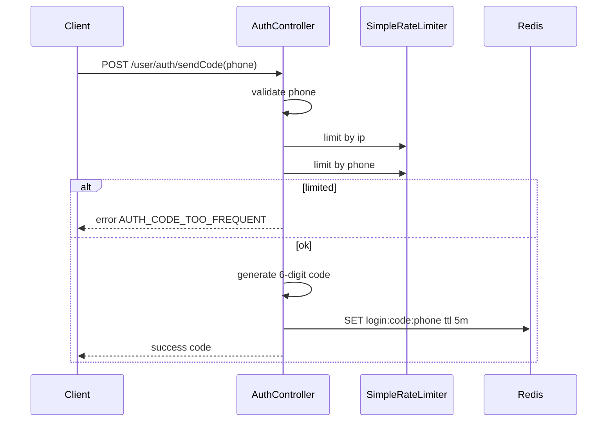
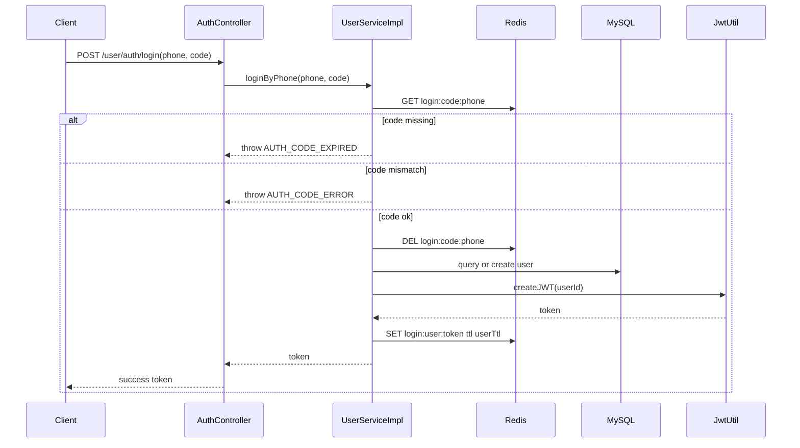
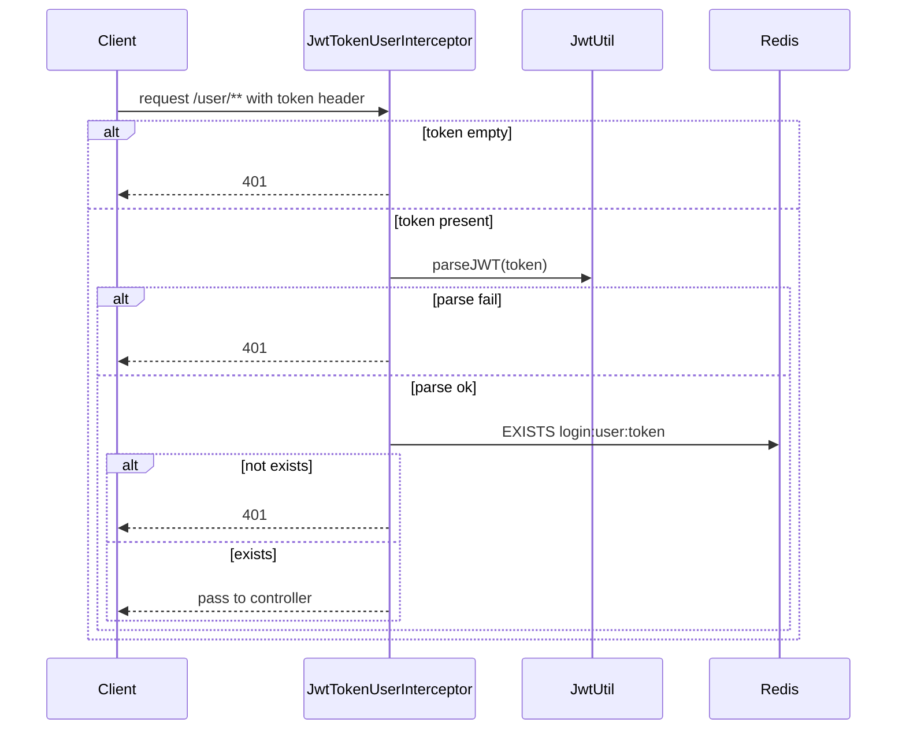

你要我把“认证 + JWT 登录模块”的 Mermaid 图**修到能正常渲染**；如果完整图太容易踩语法坑，就先给**大致结构图**，再把 **sendCode / login / 鉴权拦截**分别用小图细化。

---

## 认证模块大致结构图（可直接渲染）

---

## 小模块细化 1：发送验证码（sendCode）

---

## 小模块细化 2：登录（login）

---

## 小模块细化 3：鉴权拦截（/user/**）

如果你告诉我你用的是哪种 Mermaid 渲染器（Typora / Obsidian / GitLab / Mermaid Live / VSCode 插件），我还能按它的“最严格语法”再收敛一版，保证零报错。
你要我基于 `triphub` 当前的“sendCode + login + 鉴权拦截（JWT + Redis 登录态）”实现，整理出**面试官最可能问的问题**，并给出**可以直接复述的详细回答**。我先把你刚打开的 `docs/auth/sendcode+login+鉴权.md` 读一下，确保 Q&A 完全贴合你项目的接口与细节。

[1 tool called]

你要我**基于你的项目 `@triphub` 的“sendCode + login + JWT 鉴权拦截（Redis 验证码 + Redis 登录态）”实现**，整理出**面试官最可能问到的问题**，并给出**可以直接复述的详细回答**。

下面这些 Q&A 都严格贴你现在的代码与约定（关键文件：`AuthController`、`UserServiceImpl`、`JwtTokenUserInterceptor`、`RedisConstants`、`JwtUtil`、`JwtProperties`、`SimpleRateLimiter`、`GlobalExceptionHandler`、`Result/ErrorCode/BaseException`）。

---

## 最可能的面试问题 & 详细回答（可背诵）

### 1）你把“验证码登录”整条链路讲一下（从 sendCode 到鉴权）
- **回答**：我这套是三段：  
  - **sendCode**：`POST /user/auth/sendCode` 校验手机号格式 → IP/手机号维度限流 → 生成 6 位验证码 → 写 Redis `login:code:{phone}`，TTL 5 分钟（`RedisConstants.LOGIN_CODE_TTL`）。Demo 为了联调，会把验证码直接返回；生产会改成短信下发不回传。  
  - **login**：`POST /user/auth/login` 调用 `UserServiceImpl.loginByPhone`，从 Redis 取验证码比对，不存在=过期，错误=不匹配；成功后 **DEL** 验证码防重放；然后查/建用户，签发 JWT（`JwtUtil.createJWT`，HS256），再把 `login:user:{token}` 写 Redis，TTL 跟 JWT 一致，形成“服务端可控登录态”。  
  - **鉴权**：`JwtTokenUserInterceptor` 对 `/user/**` 解析 JWT 拿 userId 写 `BaseContext`，再查 Redis 是否存在 `login:user:{token}`，不存在就 401（表示退出/踢下线/过期），存在才放行。

---

### 2）你为什么不用传统 Session？为什么用 JWT？
- **回答**：JWT 的优点是**无状态**，请求自带身份信息（userId），扩容多实例时不需要 session 粘性；验证成本低（签名校验）。  
  但 JWT 纯无状态有个硬伤：**签发后服务端很难单独让某个 token 失效**。所以我做了折中：JWT 负责“身份声明”，Redis `login:user:{token}` 负责“是否仍有效”，实现“可踢人/可登出”，同时不引入复杂的 session 体系。

---

### 3）验证码为什么要放 Redis？为什么要 TTL？为什么要用后删除？
- **回答**：  
  - 放 Redis：多实例共享、读写快、天然支持 TTL。  
  - TTL：验证码必须短期有效，降低泄露风险，也能自动清理。  
  - 用后删除：防止重放（同一个 code 被重复用来登录），这是验证码登录最基本的安全要求。

---

### 4）你现在 `sendCode` 返回验证码，这不是安全漏洞吗？
- **回答**：是的，**这是 Demo 联调手段**。真实环境应该：  
  - 只返回“发送成功”，验证码通过短信服务发给用户；  
  - 并且记录短信发送结果、失败重试/降级策略。  
  我会在面试里明确说：这是为了快速跑通业务链路，生产必须去掉。

---

### 5）验证码可能被暴力猜测，你怎么防？
- **回答**：我做了两层：  
  - **发码限流**：`SimpleRateLimiter` 按 IP + 手机号分别限流（1 分钟/20 次、1 小时/5 次）。  
  - **进一步可加**：登录时也做限流（按 phone/IP 对 `login` 做计数），否则攻击者可以绕过 sendCode 的限流直接爆破 login。  
  现在项目里 sendCode 已有，login 限流属于后续很自然的补强点。

---

### 6）验证码校验存在并发/竞态吗？怎么修？
- **回答**：有一个经典竞态：两次并发 login 同时 GET 到同一个 code，然后都通过，再分别 DEL。  
  最简单的修法是把 “校验 + 删除” 做成**原子操作**：  
  - Redis 6.2+ 可以用 `GETDEL`；  
  - 或者用 Lua 脚本：读取、比较、删除一步完成。  
  这是正确工程化，不需要引入一堆新类，KISS 地用 Redis 原子能力即可。

---

### 7）你为什么用 `Math.random()` 生成验证码？这够安全吗？
- **回答**：严格来说不够，`Math.random()` 不是加密安全随机。  
  生产要改成 `SecureRandom` 生成 6 位数字，成本很低，收益很高。Demo 用 `Math.random()` 是为了简单，但我会主动指出这是可改进点。

---

### 8）JWT 里放了什么？为什么只放 userId？
- **回答**：当前只放 `userId`（claims 里 `userId`），理由是：  
  - JWT 体积越小越好，放太多用户信息容易变大、泄露风险更高；  
  - 用户资料应该从 DB/缓存取，不应该靠 token 传播；  
  - userId 足够支持绝大多数鉴权与业务查询。

---

### 9）拦截器为什么要再查一次 Redis？只验 JWT 不行吗？
- **回答**：只验 JWT 可以，但服务端无法踢人/登出。  
  我查 Redis 是为了“**服务端可控**”：  
  - 删除 `login:user:{token}` 就能让 token 立即失效；  
  - 支持“强制下线”“改密后全端下线”等真实需求。  
  缺点是每次请求多一次 Redis IO。权衡上，这个项目是正确的工程折中：简单、可解释、可控。

---

### 10）你现在用 `login:user:{token}` 当 key，会不会太占内存？有更省的做法吗？
- **回答**：token 作为 key 会更长，占用会比用 sessionId 大一些。更省的方式：  
  - 用 `login:user:{userId}` 存一个“当前有效 tokenVersion/设备信息”，token 里带 version；  
  - 或用随机 `sessionId` 当 key，token 只带 sessionId。  
  但这会带来更多协议字段和迁移成本。当前项目规模下，用 token 当 key 足够简单直观（KISS），面试我会说明这是权衡点。

---

### 11）你怎么实现“退出登录 / 踢下线”？
- **回答**：我已经把能力准备好了：  
  - **登出**：提供一个 `/user/auth/logout`，拿到请求头 token，直接 `DEL login:user:{token}`。  
  - **踢下线**：管理员侧同理删 key，或者删掉该用户所有 token（如果改成 userId 维度存储会更方便）。  
  现在拦截器已经会检查 Redis key 是否存在，所以删 key 立刻生效。

---

### 12）你们的错误码怎么设计的？为什么要引入 `ErrorCode`？
- **回答**：原来只有 `Result.error(msg)`，前端只能靠字符串判断，很脆弱。  
  我引入 `ErrorCode`，让认证场景有稳定 code：  
  - 参数错、手机号格式错、验证码过期/错误、限流等都有明确 code；  
  - `BaseException` 携带 code，`GlobalExceptionHandler` 统一转成 `Result(code,msg)`。  
  这是最小化改动的规范化：不引入大而全的错误体系，但把最痛的地方先做对。

---

### 13）鉴权为什么用 `BaseContext`？这安全吗？会不会串号？
- **回答**：`BaseContext` 本质是 ThreadLocal，用于把当前用户 id 放到当前请求线程上下文里，Controller/Service 不用层层传参。  
  串号风险来自 ThreadLocal 不清理。`JwtTokenUserInterceptor.afterCompletion` 会 `BaseContext.clear()`，所以单线程请求链路安全。  
  需要注意：如果把 userId 用在异步线程池里（比如 `@Async`），ThreadLocal 不会自动传播，需要显式传递或不用 ThreadLocal。

---

### 14）你怎么防止 token 被盗用？
- **回答**：基础策略：  
  - 全链路必须 HTTPS；  
  - token 放 header（项目里通过 `JwtProperties.userTokenName` 配置），避免放 URL；  
  - 缩短 token TTL；  
  - 发现异常可通过删 Redis 登录态立即止血。  
  更进一步可以做设备绑定/风控，但那已经超出这个项目的复杂度范围。

---

### 15）`SimpleRateLimiter` 是什么算法？有什么问题？
- **回答**：它是 Redis INCR + EXPIRE 的**固定窗口计数**限流：简单、好解释、够用。  
  问题是窗口边界可能出现突刺（例如 59 秒和 61 秒各打满），精度不如滑动窗口/令牌桶。  
  但在验证码接口这种“防刷”场景，我宁可用简单可靠的计数方案，不引入复杂度；需要更平滑再升级到滑动窗口或 token bucket。

---

## 面试官最爱追问的“你项目里真实细节”一句话答法（加分用）

- **验证码 key**：`login:code:{phone}`，TTL=5min，用后删除防重放（`RedisConstants.LOGIN_CODE_KEY/TTL`）。  
- **登录态 key**：`login:user:{token}`，TTL=JWT TTL，用于踢下线/登出。  
- **鉴权两步**：JWT 签名校验 + Redis key 存在性校验。  
- **错误处理**：`BaseException(ErrorCode)` → `GlobalExceptionHandler` → `Result(code,msg)`。

---

如果你愿意，我可以再给你一份“**面试手撕式追问清单**”：比如面试官让你当场设计 `logout`、多端登录互踢、refresh token、GETDEL/Lua 原子校验验证码、以及 Redis 宕机时鉴权降级策略，你该怎么用最少改动把它讲圆。
你刚才说“好的”，我理解为：你想要我继续把**面试官会追问的更硬核问题**也整理出来，并给出**能当场讲圆、可落地到你 `triphub` 代码里的回答**（logout、多端互踢、refresh token、Redis 宕机降级、验证码原子校验等）。

---

## 进阶追问清单（高频）+ 你可以怎么答

### 1）让你现场设计：`logout` 怎么做？
- **回答**：我现在已经把“服务端可控登录态”存到了 Redis：`login:user:{token}`。  
  所以 logout 最简单：提供 `POST /user/auth/logout`，从请求头拿 token，执行 `DEL login:user:{token}`。拦截器每次请求都 `EXISTS` 这个 key，所以删除后立即生效，达到“立刻登出”。

---

### 2）多端登录互踢：A 登录后 B 再登录，A 需要下线，怎么改？
- **回答**：我会把登录态从“token 维度”升级成“userId 维度”，仍然保持简单：  
  - Redis 存 `login:user:{userId} -> currentToken`（或 tokenVersion）。  
  - JWT 里带 `userId` + `tokenVersion`（或只带 sessionId）。  
  - 登录成功写 Redis 覆盖旧值；拦截器读取 token 解析出 userId，再比对 Redis 里是否等于当前 token（或 version 一致）。不一致就 401。  
  这样天然支持“后登录踢掉先登录”。

---

### 3）refresh token 怎么设计？为什么需要？
- **回答**：现在只有 access token（JWT），过期就得重新登录。  
  如果要体验更好：  
  - **短 access token（比如 15 分钟）** + **长 refresh token（比如 7 天）**；  
  - refresh token 存 Redis（或 DB）并绑定设备/用户；  
  - `/user/auth/refresh` 用 refresh token 换新 access token，同时刷新 Redis 登录态 TTL。  
  这样安全性更高（access token 短），用户体验也更好。

---

### 4）Redis 宕机了怎么办？你现在拦截器每次都查 Redis
- **回答**：两种策略，面试我会明确讲“取舍”：
  - **Fail-closed（更安全）**：Redis 不可用就拒绝请求（401/503），防止被绕过踢下线机制。适合强安全场景。  
  - **Fail-open（可用性优先）**：Redis 不可用时只做 JWT 校验，暂时放行，服务恢复后再恢复踢人能力。适合对可用性要求更高的场景。  
  你的 `triphub` 更偏 demo/业务服务，我会倾向 fail-open，并打 ERROR 日志告警，避免雪崩。

---

### 5）验证码校验为什么要原子？你会怎么做原子校验？
- **回答**：因为并发登录可能导致同一个验证码被用两次。  
  原子方案最简单：  
  - Redis 6.2+：用 `GETDEL` 拿到 code 后立刻删除，再比对；  
  - 或 Lua：`GET -> compare -> DEL` 一步完成。  
  这不需要复杂的类设计，直接用 Redis 的原子能力，KISS。

---

### 6）为什么你把登录态 key 设计成 `login:user:{token}`？会有什么代价？
- **回答**：好处是最简单直观：token 一删就失效。  
  代价是 key 变长，Redis 内存占用更高，而且要实现“踢某用户所有端”不方便。  
  若要“以用户为中心”管理登录态，就用 `login:user:{userId}` 存当前 token 或 tokenVersion，更省、更可控，也更容易做多端策略。

---

### 7）JWT 安全细节：签名算法、密钥、claims，你怎么解释？
- **回答**：当前 `JwtUtil` 用 HS256 对称签名；密钥在 `JwtProperties.userSecretKey`。  
  claims 只放 `userId`，避免敏感信息进 token。  
  生产环境要保证：密钥足够随机、按环境隔离、定期轮换；全链路 HTTPS；token TTL 合理。

---

### 8）为什么 `BaseContext` 可能在异步场景出问题？怎么修？
- **回答**：`BaseContext` 是 ThreadLocal，只在当前请求线程有效。  
  如果业务把用户信息带到线程池/异步任务，会丢失或串号。  
  修法：显式传 userId 参数，或者用可传播的上下文工具（但我会强调：**业务关键路径别依赖 ThreadLocal 跨线程**，传参最简单也最稳）。

---

### 9）现在错误码和 HTTP 状态码怎么配合？面试官会追问
- **回答**：现在项目里 `Result` 是业务层统一包装，错误码在 body 里，部分鉴权失败直接 401。  
  更规范的做法：  
  - **HTTP 语义**：未认证 401，没权限 403，参数错 400，限流 429；  
  - **业务语义**：body 里再放 `ErrorCode`，前端根据 code 做精细提示。  
  你的项目目前是“最小改动引入业务错误码”，可以继续演进到更标准的 HTTP 状态码体系。

---

## 如果你要我继续“落地到代码”的下一步建议（不啰嗦，都是面试加分点）

- 加一个 `logout` 接口（删 `login:user:{token}`）。  
- 给 login 加限流（按 phone/IP 防爆破）。  
- 验证码用 `SecureRandom` + `GETDEL/Lua` 原子校验。  
- 明确 Redis 宕机策略（fail-open 或 fail-closed），并加日志告警。

你想我把上面这几个点也直接改进到 `triphub` 代码里吗？只要你回复“改”，我就按 KISS 原则一次性补齐（并把 Mermaid 图同步更新）。