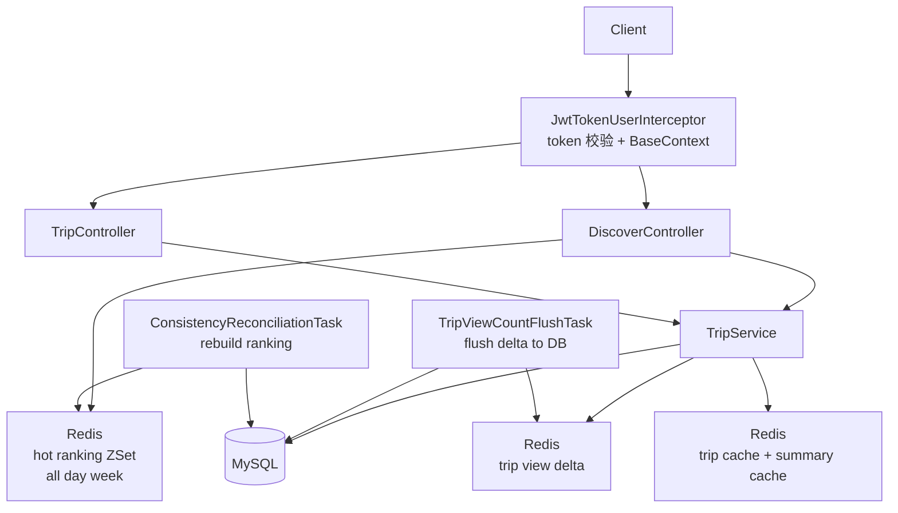
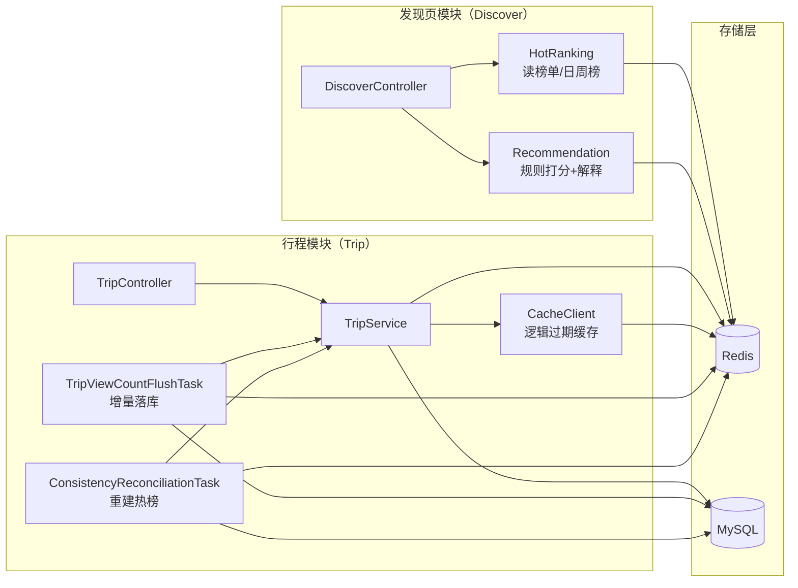
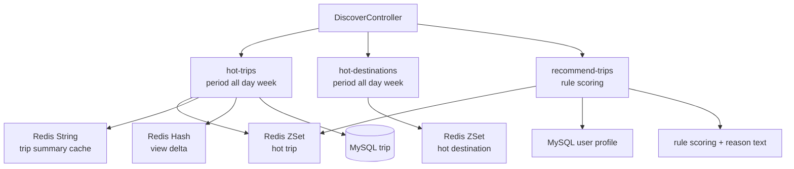

## 发现页模块（Discover）

> 覆盖发现页的 3 个接口：热门行程、热门目的地、推荐行程；并串联“热度写入、浏览量最终一致、排行榜重建”闭环。

### 1. 核心接口

- **热门行程**：`GET /user/discover/hot-trips?limit=10&period=all|day|week`
  - Redis：
    - `all`：`ZREVRANGE hot:trip 0 N-1`
    - `day`：`ZREVRANGE hot:trip:day:yyyyMMdd 0 N-1`
    - `week`：`ZREVRANGE hot:trip:week:YYYYww 0 N-1`
  - 返回：`TripSummaryDTO`（摘要 DTO），减少实体膨胀/敏感字段泄露风险
  - 数据获取：优先 Redis 摘要缓存 `cache:trip:summary:{id}`，未命中才回源 DB；并叠加 `trip:view:delta` 增量展示更实时
- **热门目的地**：`GET /user/discover/hot-destinations?limit=10&period=all|day|week`
  - Redis：
    - `all`：`ZREVRANGE hot:dest 0 N-1`
    - `day`：`ZREVRANGE hot:dest:day:yyyyMMdd 0 N-1`
    - `week`：`ZREVRANGE hot:dest:week:YYYYww 0 N-1`
  - 返回：城市名列表
- **推荐行程（规则打分版）**：`GET /user/discover/recommend-trips?limit=10&period=all|day|week`
  - 候选：来自热门行程（可配置候选数 = limit * 5，上限 100）
  - 排序：`viewCount` 底分 + 用户画像 `tags` 命中加分（目的地命中/标题命中）
  - 解释：每条行程返回中文推荐理由（可解释排序）

### 2. 对齐代码的总流程图（Mermaid）

> 说明：你本地的 Mermaid 解析器对“边标签里带括号/复杂符号”比较敏感（例如 `(... )`），容易报错。
> 所以这里的“总流程图”刻意画得更粗粒度：**不在边上写复杂文字**，把细节放到后面的“小模块图 + 文字说明”里。

### 3. 模块“大图”（面试讲解用）

### 4. 模块“小图”（发现页内部拆解）

### 3. 面试官更看重什么（发现页模块）

- **缓存/热榜建模是否“像能上生产”**
  - ZSet 排行榜：`ZINCRBY` 写、`ZREVRANGE` 读 TopN（复杂度与性能都讲得通）
  - 热榜读链路：先拿 id，再批量查 DB，再按 ids 重排（避免 IN 无序问题）
- **一致性与抗故障**
  - 浏览量写放大：请求只写 Redis 增量，定时批量刷回 DB（最终一致）
  - Redis 丢数据自愈：基于 DB 事实源的定时重建
  - 重建“无空窗”：tmp key + `RENAME` 原子切换（这是典型加分点）
- **权限与口径一致**
  - 详情访问做可见性校验
  - 热榜写入与重建口径统一：只包含公开行程（否则会污染榜单/泄露隐私）
- **可观测性**
  - 关键动作有指标埋点（热榜更新次数、缓存命中等），方便运营/排障

### 4. 还能怎么改（按优先级）

- **P0：彻底收敛 visibility 语义（不做好友功能也要“明确”）**
  - 保留字段很有必要：至少要区分 **公开/私有**；否则发现页和热榜没有边界
  - 建议收敛为两档：`0=私有`、`2=公开`；`1` 视为非法（接口参数校验直接拒绝）
  - 统一默认值：创建行程不传则默认 `2`
- **P1：抗刷/热度算法升级**
  - 目前热度是纯计数，容易刷且长期固化
  - 可做：按天/周榜（分 key）、时间衰减、同用户短时间去重、简单限流
- **P1：热榜读减少 DB 压力**
  - 现在每次读热榜都要 `listByIds` 查 DB
  - 可用：行程摘要缓存（Redis Hash/JSON），或热榜冗余存摘要字段（最终一致更新）
- **P2：返回结构更安全**
  - 热门行程接口建议返回 `TripSummaryDTO`（只暴露必要字段），避免实体字段膨胀带来的风险
- **P2：推荐从“拼理由”走向“可解释的规则打分”**
  - 先做规则打分（tag/城市/天数/预算）形成可解释排序，再考虑接 LLM 做二次排序（可降级）

