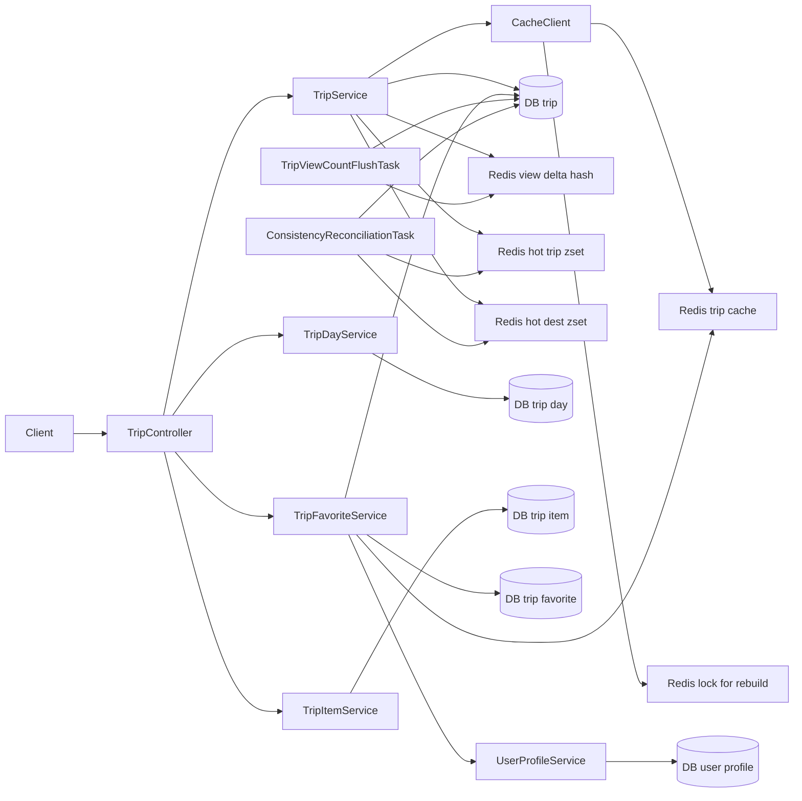
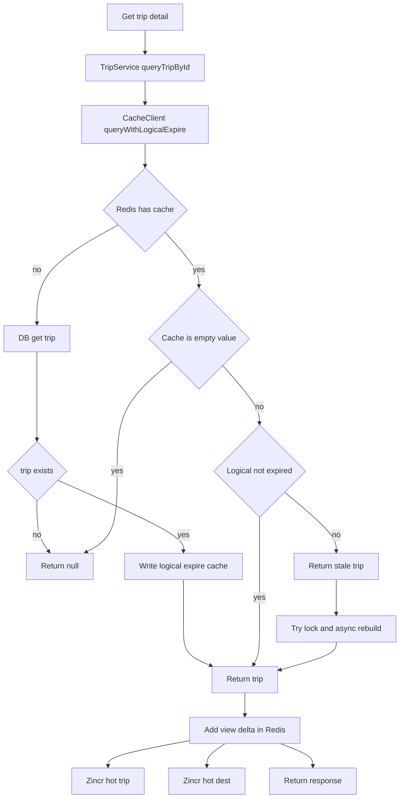
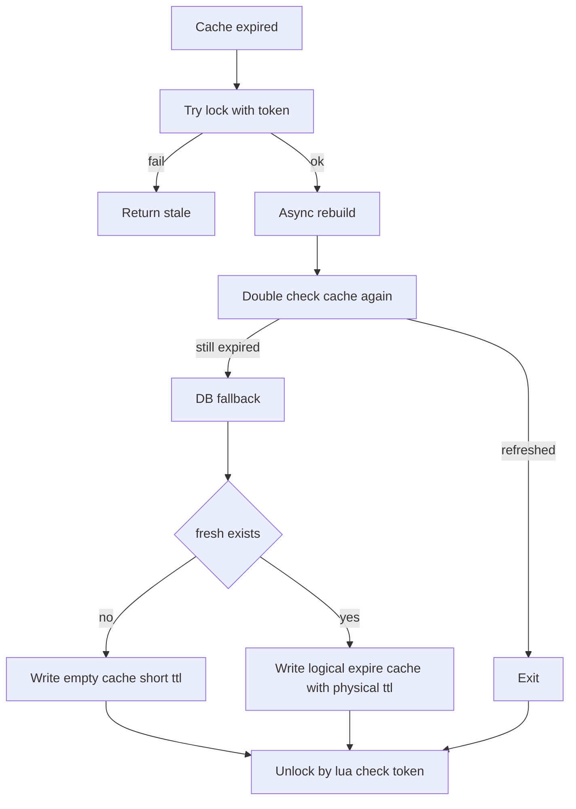
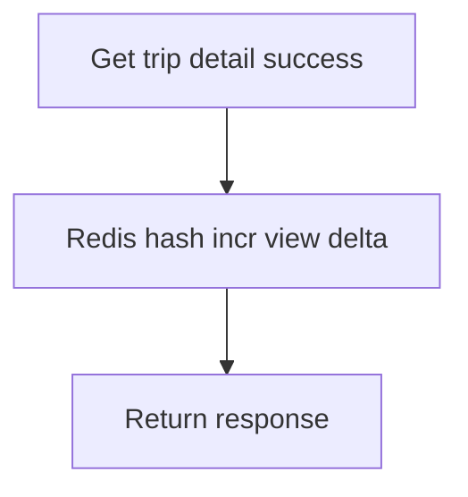
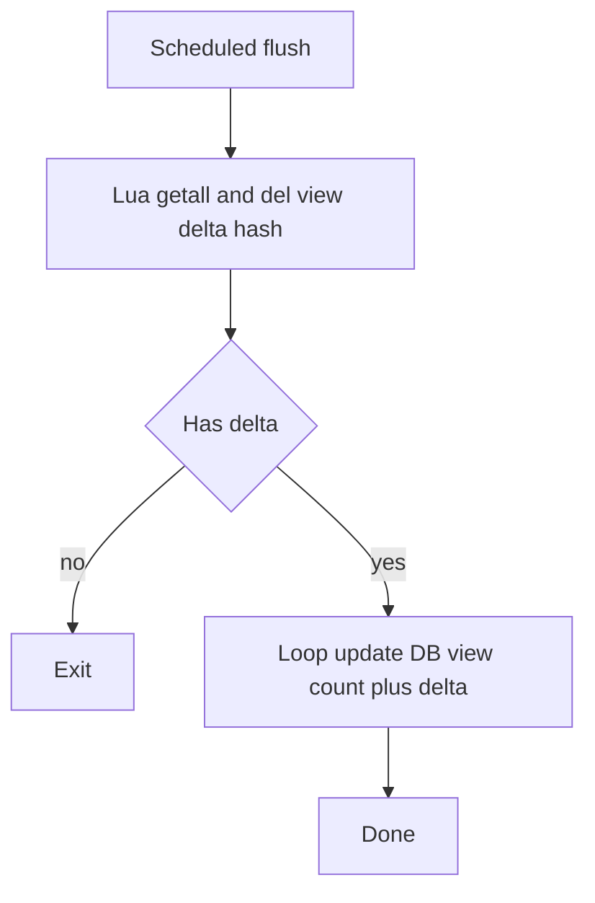
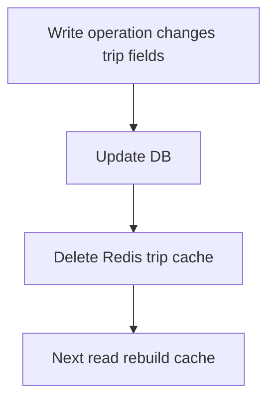
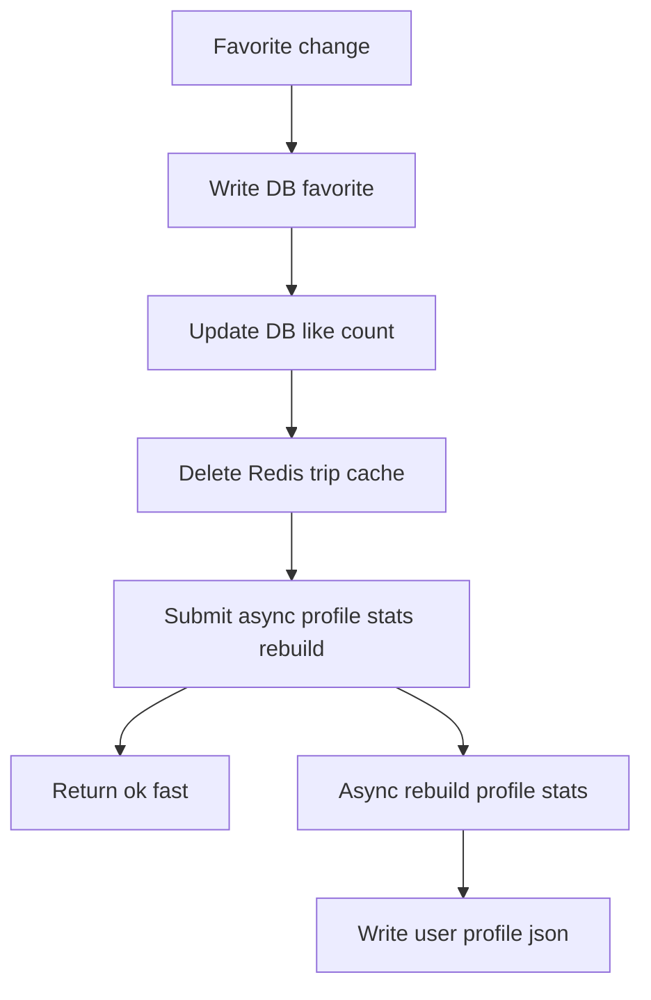

你要我给出当前 **Trip 模块**的 Mermaid 图（大模块 + 小模块业务流程），并且把每个模块和优化点写清楚，方便你向面试官解释“为什么这么设计、解决什么问题、边界在哪里”。

下面所有 Mermaid 都用**最保守语法**：只用 `graph LR`/`graph TD`，节点文案尽量不含特殊符号，避免 Mermaid 插件解析报错。

### 0) 读这份文档你应该得到什么

- **你能讲清 Trip 模块做什么**：Trip 主表 + TripDay + TripItem + TripFavorite，再加上缓存、热度、计数落库等支撑能力。
- **你能讲清三条主线**：
  - **读主线**：详情读缓存，逻辑过期时先返回旧值并异步重建
  - **热度主线**：访问详情更新热门行程与热门目的地榜单
  - **优化主线**：并发正确性、缓存生命周期、一致性与写放大

### 1) Trip 模块大图（总览）

#### 1.1 总览图解释（你要怎么讲）

- **入口层**
  - `TripController`（`triphub-server/.../controller/user/TripController.java`）承接 Trip 相关 HTTP 请求。
- **核心服务层**
  - `TripService`：详情读取 + 热度更新 + viewCount 增量写入
  - `TripDayService`：按天读写（note）
  - `TripItemService`：条目增删改
  - `TripFavoriteService`：收藏关系 + likeCount 更新 + 画像 stats 更新
- **支撑能力**
  - `CacheClient`：逻辑过期缓存与互斥锁重建
  - `TripViewCountFlushTask`：把 Redis 的 viewCount 增量定时批量刷回 DB（最终一致）
  - `ConsistencyReconciliationTask`：周期性从 DB 重建热门榜（Redis 丢数据时自愈）
- **关键 Redis 结构（你必须能说清楚）**
  - Trip 详情缓存：`cache trip`（逻辑过期缓存，内部包含 expireTime 与 data）
  - 重建锁：`lock for rebuild`（token + Lua 安全解锁）
  - viewCount 增量：`view delta hash`（field=tripId，value=delta）
  - 热门榜：`hot trip zset` 与 `hot dest zset`

### 2) 小模块一：行程详情读取（带缓存与热点计数）

#### 2.1 读流程解释（面试官最常问的一条主线）

- **这条链路同时解决三件事**
  - **命中加速**：大多数请求直接从 Redis 读
  - **防击穿**：过期时用互斥锁保证只有一个线程回源重建
  - **可用性优先**：逻辑过期时先返回旧值，用户不被阻塞
- **cache miss（Redis 没 key）**
  - 回源 DB 查 Trip
  - DB 有：写逻辑过期缓存并返回
  - DB 无：写空值缓存（短 TTL）防穿透并返回 null
- **cache hit**
  - 命中空值缓存：直接返回 null（不打 DB）
  - 命中逻辑过期缓存：
    - 未过期：直接返回
    - 已过期：返回旧值 + 尝试抢锁触发异步重建
- **热度更新（读后写）**
  - viewCount：不再每次写 DB，而是写入 Redis 增量（Hash）
  - 热门榜：ZSet 做 `ZINCR`，用于发现页与推荐候选

### 3) 小模块二：逻辑过期缓存重建（并发正确性重点）

#### 3.1 重建流程解释（你要强调的两个坑）

- **坑一：锁误删**
  - **问题**：如果 unlock 直接 DEL，锁过期后可能被别人抢到，旧线程 finally 会误删新锁
  - **做法**：SETNX 时写 token；unlock 用 Lua 校验 `get == token` 才 del
  - **收益**：并发正确性更强，这是面试加分点
- **坑二：逻辑过期缓存的生命周期**
  - **问题**：只做逻辑过期会导致冷 key 长期驻留
  - **做法**：写逻辑过期缓存时同时设置更长的物理 TTL
  - **收益**：资源可控，体现工程意识

### 4) 优化点一：viewCount 写放大优化（请求只写 Redis 增量）

#### 4.1 请求侧（快路径）

#### 4.2 定时任务侧（批量落库）

#### 4.3 为什么要做这个优化（你怎么回答高 QPS 怎么办）

- **原始问题**：每次详情都写 DB 的 `view_count + 1`，属于典型写放大
- **优化策略**：详情请求只写 Redis（高吞吐），定时批量刷回 DB（最终一致）
- **关键点**：
  - 任务用 Lua 原子“取走一批增量再落库”，避免读删竞态
  - 响应端可以叠加 Redis 增量，避免页面长期显示旧 viewCount

### 5) 优化点二：缓存一致性（写后删缓存 cache aside）

#### 5.1 为什么写后要删缓存（你要能讲清什么时候删）

- **适用场景**：只要写操作会影响 Trip 详情展示，就应该删 trip 详情缓存
  - 例如：收藏导致 likeCount 变化、更新 Trip 标题/可见性、更新行程天数等
- **为什么不直接写缓存**
  - cache-aside 更简单：写 DB 成功后删缓存，下一次读自然重建
  - 面试官认可：简单、可控、容易保证最终一致

### 6) 优化点三：收藏 stats 重算异步化（降低接口延迟）

#### 6.1 为什么要异步化（你怎么回答收藏接口慢怎么办）

- **原始问题**：收藏变更后同步重建 stats，需要扫描用户所有收藏并聚合城市，属于 O(n)
- **优化**：stats 重建放到异步线程池
  - 主请求只保证：收藏写入成功 + likeCount 更新成功 + 缓存失效成功
  - stats 属于画像增强，允许最终一致
- **面试表达**：典型“主链路 vs 非关键链路”拆分，保证核心接口稳定

### 7) 面试官围绕这套设计会追问什么（最少要会的回答）

- **并发正确性**
  - 为什么需要 token + Lua 解锁
  - 锁 TTL 如何选择，太短太长分别有什么问题
  - double-check 为什么能减少无意义回源
- **缓存生命周期**
  - 逻辑过期与物理 TTL 区别
  - 空值缓存为什么要短 TTL
  - 什么场景需要写后删缓存
- **性能与最终一致**
  - viewCount 写放大怎么解决（Redis 增量 + 定时落库）
  - 为什么热门榜用 ZSet
  - 最终一致带来哪些展示差异，怎么缓解（叠加 delta）

你要我针对 **Trip 模块（行程主表 + 按天 + 条目 + 收藏 + 缓存 + 热度 + viewCount 增量落库）**，把面试官可能会问到的问题尽可能“全覆盖”列出来，并给出可直接背诵的详细答案。下面按主题分类，你可以按“从上到下”背，也可以按面试官提问方向跳着答。

## 1. 模块定位与边界

- **Q1：Trip 模块到底做什么？**
  - **A**：Trip 模块是“行程领域”的完整能力集合：  
    - **Trip 主资源**：创建、详情、我的列表  
    - **TripDay**：行程按天组织（dayIndex、note）  
    - **TripItem**：一天的条目（时间段、类型、地点、备注）  
    - **TripFavorite**：收藏关系、likeCount 维护、画像 stats 反哺  
    - **支撑能力**：Trip 详情缓存（逻辑过期 + 异步重建）、热门榜（ZSet）、浏览量 viewCount（Redis 增量 + 批量落库）  
    它不是单表 CRUD，而是“一个聚合根 + 多个子资源 + 读写优化”的领域模块。

- **Q2：为什么要拆 TripDay/TripItem？放一张 JSON 字段不行吗？**
  - **A**：JSON 存在可行，但会带来：按天/按时间排序查询困难、局部更新成本高、并发编辑冲突难处理、统计查询差。拆表后：
    - 条目按时间排序天然用索引解决
    - 单个条目更新不会重写整个大 JSON
    - 支持分页/过滤/聚合统计

- **Q3：Trip 详情为什么不直接把 day/items 一起返回？**
  - **A**：读模型要按访问频率与体积拆分：Trip 主信息访问更频繁，day/items 体积更大、变化更频繁。拆接口能：
    - 减少不必要的 IO/序列化
    - 缓存策略更清晰（主信息缓存，计划细节按需加载）

## 2. 接口与业务流程（你要能画链路）

- **Q4：GET trip detail 的完整链路是什么？**
  - **A**：Controller → `TripService.queryTripById` → `CacheClient.queryWithLogicalExpire` 读 Redis/回源 DB → 返回 Trip → `increaseViewCountAndHotScore` 写 Redis view delta + ZSet 热度 → 返回响应。

- **Q5：GET day detail 的权限怎么保证？**
  - **A**：先用 userId（BaseContext）查 Trip 并校验 owner，再查 TripDay/TripItem。这样任何 day/item 操作都不会绕过 Trip 的所有权。

- **Q6：新增 TripItem 为什么要“确保 day 存在”？**
  - **A**：保证数据结构完整：item 必须属于一个 day。接口层做“get or create day”，让前端不需要关心 day 的生命周期，简化交互。

## 3. 缓存设计（面试高频）

- **Q7：你用的是什么缓存策略？解决什么问题？**
  - **A**：逻辑过期 + 互斥锁 + 异步重建：
    - **解决击穿**：热点 key 过期时避免并发回源 DB
    - **提升可用性**：过期时先返回旧值，用户不阻塞
    - **最终一致**：后台异步重建把缓存刷新到最新

- **Q8：逻辑过期和物理 TTL 有什么区别？**
  - **A**：
    - **逻辑过期**：key 仍存在，内部有 expireTime；过期后可返回旧值并触发重建。
    - **物理 TTL**：到期 key 直接不存在；请求必须回源 DB 才能得到数据。
    在你的实现里：逻辑过期用于稳定延迟，物理 TTL 用于最终回收冷数据。

- **Q9：缓存穿透怎么防？**
  - **A**：DB 查不到时写入空值缓存（空字符串）并设置短 TTL；下次命中空值直接返回 null，避免反复打 DB。

- **Q10：空值缓存 TTL 为什么要短？**
  - **A**：避免“误伤”：数据可能之后被创建，如果空值 TTL 很长会长期看不到新数据。短 TTL 在防穿透与可恢复之间平衡。

- **Q11：异步重建时 DB 返回 null 怎么办？**
  - **A**：不能写“null + 未来 expireTime”的逻辑过期缓存，否则可能长期遮蔽真实数据。正确做法是：写空值缓存并用短 TTL（或者不写）。

- **Q12：互斥锁为什么要 token + Lua 解锁？**
  - **A**：避免误删别人的锁：锁过期后可能被其他线程重新获得，旧线程 finally 的 DEL 会删除新锁。token 写入 value，Lua 校验 `get == token` 才删除，实现原子安全解锁。

- **Q13：锁 TTL 怎么选？**
  - **A**：覆盖重建耗时的 P99：太短会锁过期并发重建（击穿回潮）；太长会影响故障恢复速度。你现在用固定 30s 是 KISS；更复杂可做看门狗续期或用 Redisson RLock。

- **Q14：为什么重建前要 double-check？**
  - **A**：减少无意义回源：拿到锁并不代表缓存一定没被刷新。double-check 能避免重复 DB 查询和重复写缓存。

- **Q15：缓存一致性怎么做？**
  - **A**：Cache-aside：写 DB 成功后删除缓存 key；下一次读 miss 回源并重建。你已经对 likeCount 变化做了“写后删缓存”。

- **Q16：哪些字段不适合直接放在详情缓存里？**
  - **A**：高频变化字段：viewCount、likeCount。否则要么缓存频繁失效、要么展示长期不准。更合理：静态字段缓存，动态字段走增量叠加或单独读取。

## 4. 热度榜与计数（又一个高频）

- **Q17：热门榜为什么用 ZSet？**
  - **A**：ZSet 支持高吞吐增量（ZINCRBY）与快速 TopN（ZREVRANGE），天然适配“实时累加 + 排行榜”。

- **Q18：为什么 viewCount 不直接每次写 DB？**
  - **A**：写放大：热点行会产生 DB 热点更新、锁竞争和 IO 压力。Redis 计数更适合高并发写，DB 只做最终落库。

- **Q19：你现在的 viewCount 方案怎么保证不丢增量？**
  - **A**：用 Lua 原子地读取并删除增量 Hash（HGETALL + DEL），把一批增量“取走”后再写 DB，新请求写到新的增量里，避免读删竞态。失败时下次任务仍会处理（最终一致）。

- **Q20：最终一致会不会导致页面 viewCount 不准？**
  - **A**：短时间会有延迟。缓解方式是：返回详情时把 Redis 增量叠加到 Trip.viewCount；并且当次请求可以把 +1 直接体现到响应对象上（你已做）。

## 5. 权限与数据安全（常被追问）

- **Q21：如果 Trip 有可见性（公开/私密），缓存会不会越权？**
  - **A**：如果缓存 key 只按 tripId，且响应内容依赖“当前用户权限”，就可能越权。正确做法：
    - 缓存只存与用户无关的公共数据
    - 返回前做权限校验
    - 或按用户维度拆 key（成本更高）

- **Q22：你现在哪些接口做了权限校验？**
  - **A**：day/item 的读写明确校验 owner；详情接口目前返回 Trip，不区分 owner/公开（可进一步补强为：公开可读，私密仅 owner 可读，并在缓存使用前校验）。

## 6. 性能与稳定性（工程素质题）

- **Q23：Redis 挂了怎么办？**
  - **A**：读路径降级回源 DB；写路径（热度、增量、重建）失败不影响主流程，并记录告警；必要时限流重建、防止线程池堆积。生产可配熔断/降级开关。

- **Q24：异步重建线程池会不会堆积？**
  - **A**：会。需要：
    - 控制队列与拒绝策略
    - 对相同 key 做去重提交
    - 监控重建失败率与积压长度

- **Q25：收藏 stats 为什么要异步？会不会不一致？**
  - **A**：stats 是画像增强，非核心一致性要求；异步能降低接口延迟。最终一致可以接受，必要时可加“重建状态”标记或失败重试。

## 7. 数据一致性与事务（深挖题）

- **Q26：收藏接口里 DB 更新和缓存删除需要事务吗？**
  - **A**：DB 更新需要事务保证本地一致；缓存删除通常不与 DB 做分布式事务，用 cache-aside 的“最终一致”即可。极端情况下可接受短暂脏读，或用消息队列/重试补偿。

- **Q27：如何处理删除缓存失败？**
  - **A**：记录告警并重试（异步重试/定时补偿）。最坏情况是缓存短暂不一致，但不会破坏 DB 真相源。

## 8. 观测、压测与排障（加分题）

- **Q28：你会监控哪些指标？**
  - **A**：
    - 缓存命中率、空值命中率、重建次数/失败次数、重建耗时
    - DB 回源 QPS、P95/P99 延迟
    - viewCount 增量落库任务每次处理数量、更新行数、耗时、失败率
    - ZSet 更新 QPS、TopN 查询耗时

- **Q29：怎么验证“只有一个线程重建”？**
  - **A**：构造逻辑过期 key，压测同一 tripId 并发读，观测 DB 回源次数接近 1、锁命中率、以及重建日志/指标。

## 9. 可演进方向（你可以反问面试官）

- **Q30：下一步你会怎么演进？**
  - **A**（三选一讲即可）：
    - 收藏 stats 从全量重算升级为增量维护（城市计数）
    - viewCount 增量从 Hash 单 key 改为分片 key（降低热点 key）
    - 缓存从“单 key 缓存 Trip”升级为“静态字段缓存 + 动态字段独立存储与聚合返回”

你要我做两件事：**(1) 在我前面那套题库之外，再补充更多“面试官可能追问的问题+答案”；(2) 重新检查你当前 Trip 模块的代码改动是否“做得对”、以及是否与文档/设计描述一致**。我会先把关键代码与 `docs/trip/行程模块.md` 对照一遍（缓存、锁、viewCount 增量落库、写后删缓存、收藏 stats 异步），确认一致性与边界，再给你补一批更刁钻的追问题。

[6 tools called]

你要我两件事：**(1) 在现有题库之外，再补充“还可能问什么 + 答案”；(2) 复核你当前 Trip 模块的设计描述 vs 代码实现是否一致、改动是否正确**。我已经把关键代码（`TripServiceImpl`、`TripFavoriteServiceImpl`、`TripViewCountFlushTask`、`CacheClient`、`RedisConstants`）和 `docs/trip/行程模块.md` 对照过了。

## 一、当前设计 vs 代码实现：是否一致？改得对不对？

### 1) 缓存：逻辑过期 + 互斥锁 + 异步重建（含两个边界修复）——**一致且正确**
- **文档描述**：逻辑过期返回旧值；互斥锁异步重建；锁 token + Lua 安全解锁；逻辑过期缓存带物理 TTL；DB null 写空值短 TTL。
- **代码现状（完全一致）**：
  - **空值缓存命中**：`json != null && !hasText(json)` 直接 return null（防穿透） ✅
  - **miss 回源**：DB null 写 `""` + `CACHE_NULL_TTL` ✅
  - **过期返回旧值 + tryLock**：拿锁后异步重建 ✅
  - **重建 double-check**：防重复回源 ✅
  - **重建 DB 返回 null**：写空值短 TTL（避免写 null+未来逻辑过期） ✅
  - **锁安全解锁**：token + Lua 校验删除 ✅
  - **逻辑过期缓存物理 TTL**：`setWithLogicalExpire` 用 `calcPhysicalTtlSeconds` 设置更长 TTL ✅

你这块改动属于“面试官会点头”的标准答案，没明显逻辑漏洞。

### 2) viewCount 写放大：Redis 增量 + 定时批量落库 ——**一致且整体正确**
- **文档描述**：请求只写 Redis 增量；定时任务 Lua 原子取走一批增量再写 DB；响应端叠加 delta，避免长期展示旧值。
- **代码现状（基本一致）**：
  - **请求侧**：`TripServiceImpl.increaseViewCountAndHotScore` 用 Hash `increment` 写增量，并设置 TTL ✅
  - **任务侧**：`TripViewCountFlushTask` Lua `HGETALL + DEL`，再循环调用 `tripMapper.updateViewCountDelta` ✅
  - **响应端叠加**：`TripServiceImpl.queryTripById` 把 Hash delta 加到 `trip.viewCount` 上 ✅
  - **当次 +1 体验**：`increaseViewCountAndHotScore` 里直接对返回对象 `trip.setViewCount(vc+1)` ✅

**唯一我会提醒的“工程边界”**（不算 bug，但面试会追问）：
- 你现在的增量 Hash 是**全局单 key**：`trip:view:delta`。在超高 QPS 时，这个 key 可能成为 Redis 热点（虽然通常仍比 DB 好很多）。  
  - **面试答法**：可以做分片 key（按时间桶或 `tripId % N`），或用 Stream/队列聚合写入。
- `TripViewCountFlushTask` 取走一批增量后逐条 update DB，是**批量但非真正批处理 SQL**。  
  - **面试答法**：可用批量 SQL（CASE WHEN）或按批次拼接、或异步队列消费者做批写。

### 3) 写后删缓存（cache-aside）——**一致且正确**
- **文档描述**：写 DB 成功后删 Trip 详情缓存，下一次读自然重建。
- **代码现状**：收藏 add/remove 更新 `like_count` 后 `DEL cache:trip:{tripId}` ✅

这里没问题，而且是面试官最认可的简单一致性策略。

### 4) 收藏 stats 重算异步化 ——**一致且正确**
- **文档描述**：stats 重建是非关键链路，异步化，最终一致。
- **代码现状**：`TripFavoriteServiceImpl.rebuildProfileStatsAsync` 提交线程池执行，主流程不阻塞 ✅

**边界提醒**（面试会问）：
- 线程池是静态固定 2 线程，若重算慢可能排队；可以做限流/去重/改成消息队列。你的实现是 Demo 里 KISS 合理。

---

## 二、除了你已有题库，面试官还会追问什么？（再补一批“更刁钻”的）

下面这些问题更偏“深挖/追杀”，很多人答不上来，你答出来就加分。

### A. 缓存与一致性深挖

- **Q：如果缓存里是旧 Trip，但 DB 已经把 visibility 改成私密了，你返回旧缓存会不会越权？**
  - **A**：会有风险。逻辑过期缓存的前提是“旧值短暂可接受”，但**权限类字段不能脏读**。做法：
    - 权限校验不要依赖缓存，返回前必须校验（至少校验 visibility 与 owner）
    - 或者缓存只存公共字段，权限相关从 DB/更强一致路径获取

- **Q：cache-aside 里“先写 DB 再删缓存”仍可能不一致，解释一下竞态？**
  - **A**：竞态是：线程 A 读 miss 回源准备写缓存；线程 B 写 DB 并删缓存；如果 A 在 B 删除后把旧值写回缓存，会产生短暂不一致。  
    - 解法：延迟双删、写缓存带版本号、或写操作串行化（通常不做，复杂度高）。面试答法：说明你知道这个竞态，并强调业务可接受最终一致。

- **Q：为什么空值缓存用 `""`，而不是 JSON 的 null？**
  - **A**：`StringRedisTemplate` GET 到 `""` 很好区分“空值缓存命中”与“key 不存在(null)”，实现简单；JSON null 容易和反序列化逻辑混淆。

### B. 锁与并发深挖

- **Q：你用了 token + Lua 解锁，那如果线程卡死导致锁一直不释放怎么办？**
  - **A**：锁有 TTL（30s），即使线程卡死 TTL 到期也会释放；如果重建非常慢，TTL 太短会并发重建，TTL 太长会降低吞吐。面试回答：给出 TTL 选型原则（覆盖 P99），必要时看门狗续期。

- **Q：你 lock 的 value 用 UUID，为什么不是线程 ID？**
  - **A**：线程 ID 跨 JVM 不唯一且可复用；UUID 只要保证随机唯一即可。

### C. viewCount 落库深挖

- **Q：你 Lua HGETALL+DEL 后 DB 写失败了，这批增量不就丢了？**
  - **A**：是的，这是当前实现的“简化点”。更稳的做法：
    - Lua 改成“RENAMENX 到 processing key”（搬运而不是删除），写 DB 成功后再 DEL processing key；失败可重试
    - 或使用 Redis Stream/消息队列保证 at-least-once
  - 你现在的实现适合 Demo，但面试要主动承认并给出增强方案。

- **Q：为什么不用 INCR 一个 viewCount key，而要用 Hash？**
  - **A**：Hash 便于批量拉取多个 tripId 的增量并一次性清空；单 key INCR 需要扫描大量 key，落库聚合成本更高。

- **Q：viewCount 叠加 delta 会不会导致返回值比 DB 大，但落库后又回退？**
  - **A**：不会回退：DB 最终会加上 delta；只是在落库前，DB 还没反映，但响应端叠加了。落库后响应仍叠加（delta 清空后叠加消失），但 DB 已经变大，整体单调上升。

### D. 收藏 stats 深挖

- **Q：异步重建 stats 会不会出现“收藏已经成功但画像没更新”的不一致？**
  - **A**：会短暂不一致，但画像 stats 属于增强字段，不影响收藏的核心事实。可以通过：
    - 页面显示“可能稍后更新”
    - 或在读取画像时如果检测到 stale 标记，触发补偿重建

- **Q：stats 全量重算为什么慢？怎么做增量？**
  - **A**：全量重算是 O(n) 扫描收藏表 + 查 trip 表并聚合。增量做法：
    - totalFavorites: +1/-1
    - topCities: 为每个 userId 维护 city 计数（DB 或 Redis Hash），再算 topN

### E. 可运维与观测深挖

- **Q：你怎么证明缓存优化真的有效？**
  - **A**：指标对比：DB 写 QPS（view_count 更新）大幅下降；接口 P95/P99 更稳定；缓存命中率提升；重建次数与失败率可观测。

- **Q：Redis 容量或内存淘汰会影响逻辑过期吗？**
  - **A**：会。逻辑过期 key 被淘汰会变成 miss，走 DB 回源并重建。面试回答：说明你接受这种降级，并用一致性任务/预热保障。

---

## 三、结论（非常直白）
- **当前代码实现与文档描述是一致的**，并且你改的几个点（锁安全解锁、逻辑过期物理 TTL、viewCount 增量落库、写后删缓存、收藏 stats 异步）都是面试高频、且实现方式是合理的。
- **你还差的“更强工程版”**主要在 viewCount 落库的可靠性（避免 Lua 取走后 DB 写失败丢数据）和 Redis 热点分片，这些属于“追问加分项”，不是必须。
