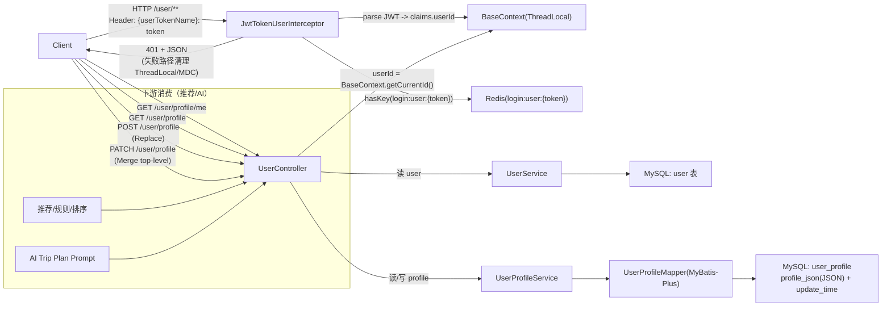
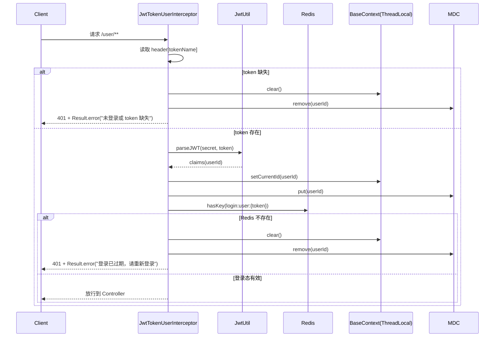
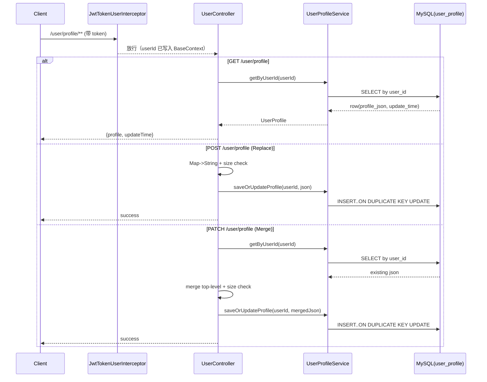

## 用户模块（User & User Profile）

你要我**按面试视角**把“用户画像模块”讲清楚，并做一组**性价比最高、KISS 的改动**，让面试官觉得你“有想法、能落地”。

### 0. 你可以怎么用这份文档答面试（30 秒）

- **先讲边界**：`/me` 是身份域（稳定），`/profile` 是偏好域（易变）。
- **再讲链路**：JWT → `BaseContext(ThreadLocal)` → Service/Mapper → `user_profile(profile_json)`。
- **最后讲改进**：并发 Upsert、鉴权语义统一 401、画像带版本（updateTime）、POST Replace + PATCH Merge、输入上限。

### 1. 这 3 个接口分别在解决什么问题？

- **GET `/user/profile/me`（身份域）**
  - 作用：回答“我是谁”（用户基础信息），用于前端初始化展示（昵称/头像等），也用于后端其它业务识别当前用户。
  - 特点：字段相对稳定，不应该被画像这种“易变 schema”污染。

- **GET `/user/profile`（画像域）**
  - 作用：回答“我喜欢什么/我适合什么”（兴趣 tags、预算、风格等），给推荐/AI/个性化 UI 当上下文。
  - 特点：画像结构经常迭代，所以使用 `profile_json`（动态 schema）而不是频繁改表/改 DTO。

- **POST `/user/profile`（画像写入）**
  - 作用：把问卷/设置页产生的画像写入 DB，作为后续推荐/AI 的事实来源。
  - 语义：当前实现是 **Replace（整份覆盖写）**，不是 Merge（部分字段合并）。

- **PATCH `/user/profile`（画像部分更新）**
  - 作用：支持“只改一个字段不丢其它字段”的更新方式。
  - 语义：当前实现是 **Merge（top-level 合并）**：incoming 覆盖同名 key，不做深度合并。

### 2. 关键链路：JWT → BaseContext → DB

- `/user/**` 请求会先被 `JwtTokenUserInterceptor` 拦截：
  - 解析 JWT 得到 `userId`；
  - 写入 `BaseContext(ThreadLocal)`，Controller/Service 直接 `BaseContext.getCurrentId()` 获取当前用户；
  - 再用 Redis 校验 `login:user:{token}` 是否存在，确认服务端登录态有效。

### 3. 面试官最爱看的“性价比改动”（你已经落地在代码里了）

#### 3.1 并发写入竞态：改为 DB Upsert（硬功夫）

- **问题**：旧写法是“先查再插/更”，并发下会撞 `user_profile.user_id` 唯一索引。
- **改法**：使用 MySQL 原子语义：
  - `INSERT ... ON DUPLICATE KEY UPDATE ...`
- **面试表达**：我用数据库原子操作消灭竞态，不靠应用层加锁（更简单、更可靠）。

#### 3.2 统一鉴权失败语义：401 + JSON 体（工程品味）

- **问题**：之前有的地方返回 401（无 body），有的地方返回 200 + `Result.error(...)`，语义割裂。
- **改法**：拦截器统一返回 **HTTP 401**，并写出统一的 JSON：
  - `{"code":xxx,"msg":"未登录或 token 无效","data":null}`
- **额外关键点（很加分）**：`preHandle` 返回 `false` 时 `afterCompletion` 不一定执行，所以失败路径也要手动清理 `BaseContext/MDC`，否则线程复用会造成串号风险。

#### 3.3 画像版本信息：带 `updateTime`（为缓存/幂等铺路）

- **问题**：只返回 profile Map，客户端/AI 无法判断画像是否更新。
- **改法**：返回 `{ profile: {...}, updateTime: ... }`，把更新时间当“弱版本号”。
- **面试表达**：给读接口加版本信息，后续可以做 ETag/条件请求、客户端缓存，降低重复读压力。

#### 3.4 明确 POST 语义 + 最小输入约束（稳定性）

- **语义**：POST 是 Replace（整份覆盖写）。如果要支持局部更新，应新增 PATCH 并明确冲突策略。
- **约束**：给画像 JSON 加了体积上限（例如 8KB），先用硬门槛防止被当垃圾桶、避免影响 DB/日志/AI prompt 拼接。

### 4. Mermaid：完整总图（模块级）

### 5. Mermaid：子模块图（鉴权与上下文子模块）

### 6. Mermaid：子模块图（画像读写子模块：Replace vs Merge）

```mermaid
flowchart TB
  subgraph Read["读取画像（GET /user/profile）"]
    R1["Controller: userId=BaseContext.getCurrentId()"] --> R2["Service: getByUserId(userId)"]
    R2 --> R3["DB: SELECT user_profile WHERE user_id=?"]
    R3 --> R4["ObjectMapper: profile_json -> Map"]
    R4 --> R5["Response: { profile, updateTime }"]
  end

  subgraph WriteReplace["写入画像（POST /user/profile，Replace）"]
    W1["Map -> JSON String"] --> W2["SizeLimit(8KB)"]
    W2 --> W3["DB Upsert(user_id unique)\nINSERT..ON DUPLICATE KEY UPDATE"]
  end

  subgraph WriteMerge["部分更新（PATCH /user/profile，Merge top-level）"]
    P1["DB: SELECT existing profile_json"] --> P2["parse -> baseMap（坏JSON则空）"]
    P2 --> P3["baseMap.putAll(patchMap)"]
    P3 --> P4["Map -> JSON String -> SizeLimit(8KB)"]
    P4 --> P5["DB Upsert 覆盖写回"]
  end
```

### 7. Mermaid：接口时序图（画像接口全家桶）

### 8. 面试题库（尽量覆盖“画像模块”会被追问的点）+ 标准回答

> 你可以按“先边界、再链路、再取舍、最后落地改动”的节奏回答。下面每条都给了**可直接复述**的版本。

#### 8.1 业务边界与接口语义（高频必问）

- **Q：为什么要把 `/user/profile/me` 和 `/user/profile` 拆成两个接口？**
  - **A**：这是两个不同领域：`/me` 是**身份域**（用户基础信息，稳定、用于初始化展示/鉴权确认）；`/profile` 是**偏好画像域**（兴趣/预算/风格，结构常变、更新更频繁）。拆开可以保持 `/me` 返回结构稳定，避免画像迭代把基础接口拖着一起变。

- **Q：这三个接口（GET me / GET profile / POST profile）的核心作用分别是什么？**
  - **A**：
    - `GET /user/profile/me`：回答“我是谁”，给前端展示与基础业务识别用户。
    - `GET /user/profile`：回答“我喜欢什么/适合什么”，给推荐/AI 提供上下文。
    - `POST /user/profile`：写入画像事实来源（问卷/设置），供后续读取与消费。

- **Q：POST `/user/profile` 是全量覆盖还是部分更新？为什么要明确？**
  - **A**：我把它明确为 **Replace（全量覆盖）**。如果不明确，前端只传一个字段（比如 budget）就可能把其它字段（比如 tags）覆盖成空，导致线上“改一项丢一片”。所以我新增了 `PATCH /user/profile` 用于 Merge，语义更贴近真实需求。

- **Q：PATCH `/user/profile` 现在怎么合并？为什么不做深度合并？**
  - **A**：当前是 **top-level 合并**：incoming 覆盖同名 key，不做深合并。这是 KISS：深合并需要定义数组合并策略、对象冲突策略、删除语义，容易越做越复杂且容易和客户端预期不一致。面试时我会说：深合并可以作为后续演进，但必须先把契约写清楚再做。

- **Q：想删除某个画像字段怎么办？**
  - **A**：当前 top-level Merge 的实现里，传 `null` 会写成 `key: null`（不是删除）。如果要“真正删除”，我会做两种方案：1）引入显式删除协议（例如 `{"$unset":["tags"]}`）；2）或定义 PATCH 的删除语义（接收 `{"tags": "__DELETE__"}` 这种显式标记）。关键是**契约要明确**。

#### 8.2 鉴权、会话与 BaseContext（非常常问，答不好会扣分）

- **Q：userId 从哪来？为什么 Controller 不需要传 userId？**
  - **A**：userId 来自 JWT：拦截器解析 token 后把 userId 写到 `BaseContext(ThreadLocal)`，Controller/Service 通过 `BaseContext.getCurrentId()` 获取当前用户。这样接口层不暴露 userId 参数，避免越权与伪造。

- **Q：只校验 JWT 就够了吗？为什么还要查 Redis `login:user:{token}`？**
  - **A**：JWT 本身是“自包含”的，理论上只要没过期就一直有效；但业务常常需要“强制下线/登出/踢人”。用 Redis 保存登录态就能做到：Redis 不存在即视为失效，实现**可撤销 token** 的效果。

- **Q：鉴权失败你怎么返回？为什么要统一？**
  - **A**：我统一用 **HTTP 401** 表达“未认证”，并返回统一 JSON body（`Result.error`），避免出现有的接口 401、有的接口 200+业务错误码的混乱，前端也更容易做统一拦截处理。

- **Q：ThreadLocal 会不会串号？你怎么避免？**
  - **A**：会，线程池复用导致上一个请求的 ThreadLocal 残留会污染下一个请求。正确做法是无论成功/失败都要清理。我不仅在 `afterCompletion` 清理，还在 `preHandle` 失败分支里也清理，因为 `preHandle` 返回 false 时不保证执行 `afterCompletion`——这是面试官很爱追问的细节。

#### 8.3 数据建模：为什么用 JSON？怎么保证可演进？（中高级必问）

- **Q：为什么 `user_profile.profile_json` 用 JSON，而不是拆成很多列？**
  - **A**：画像字段本质上是**易变 schema**（tags、预算、风格、节奏、偏好城市……），频繁调整如果拆列会导致频繁改表、改 DTO、改业务逻辑。用 JSON 可以快速迭代画像结构，把“结构演进成本”压到最低；后续如果某些字段读写非常频繁且需要索引，再把它们“反范式化”成列或生成列。

- **Q：MySQL JSON 类型 vs 用 TEXT 存 JSON，有什么差别？**
  - **A**：MySQL JSON 类型在写入时会校验 JSON 合法性，且支持 JSON 函数与生成列；TEXT 不会校验，脏数据风险更大。我们 Java 侧存 `String`，DB 侧用 JSON 类型，这样兼顾灵活与约束。

- **Q：现在 GET 画像为什么要返回 `updateTime`？**
  - **A**：这相当于“弱版本号”。客户端或下游（推荐/AI）可以据此做缓存、条件请求、或者检测画像是否发生变化，避免重复拉取与重复拼 prompt。

#### 8.4 并发一致性与写入策略（硬功夫，讲出来很加分）

- **Q：你如何处理并发写入画像的竞态？**
  - **A**：我用 MySQL 原子 Upsert：`INSERT ... ON DUPLICATE KEY UPDATE ...`，让“是否存在”的判断由数据库在唯一索引上原子完成，避免“先查再插”在并发下撞唯一键。

- **Q：Upsert 会不会丢更新（last write wins）？需要乐观锁吗？**
  - **A**：当前策略是 **Last Write Wins**，这对画像这种“最终态”通常可接受（用户最后一次提交为准）。如果要防“并发编辑冲突”，可以引入版本字段（或用 updateTime 做条件更新），实现 `WHERE update_time = ?` 的乐观锁。但这会增加前端协作成本，属于业务取舍。

- **Q：PATCH Merge 为什么要先读再写，会不会有竞态？**
  - **A**：会存在“读到旧值后被别人覆盖”的风险，但这本质是并发编辑冲突问题。如果业务要求严格一致，就要做乐观锁/版本校验；如果业务允许最终态，以用户最后提交为准，则简单实现更符合 KISS。

#### 8.5 输入校验与安全（常见追问：你怎么防滥用？）

- **Q：你如何防止画像被塞超大数据/垃圾数据？**
  - **A**：我加了最小输入约束：序列化后的 JSON 限制最大体积（8KB）。这是低成本高收益的稳定性保护。更严格的话可以加 key 白名单、字段类型校验、以及请求体大小限制（网关/容器层）。

- **Q：画像里可能包含敏感信息吗？怎么做数据安全？**
  - **A**：画像应尽量避免存 PII/敏感字段；如果必须存，要做字段分级、加密/脱敏、访问审计。接口层必须绑定当前登录用户（不允许传 userId），防止越权读取他人画像。

- **Q：为什么 GET 画像遇到坏 JSON 返回空，而不是报错？**
  - **A**：这是可用性取舍：画像不是核心交易链路，坏数据不应该把整个用户功能打挂。返回空画像能让前端/下游降级工作，同时我们可以通过日志/监控发现并修复脏数据。

#### 8.6 性能与缓存（面试官常问“QPS 上来怎么办”）

- **Q：画像读很频繁怎么办？要不要上 Redis 缓存？**
  - **A**：可以，但我会先看数据：如果推荐/AI 频繁读画像导致 DB 压力上升，可以加 `cache:user_profile:{userId}` 缓 5~30 分钟；写入（POST/PATCH）时删缓存。KISS：先让接口带 `updateTime`，再按压测结果决定是否加缓存。

- **Q：为什么不用 ETag/If-None-Match？**
  - **A**：可以做。我们已经提供了 `updateTime`，进一步可以生成 ETag（比如 profile_json 的 hash 或 updateTime）并支持 304。是否做取决于客户端是否愿意配合、以及收益是否足够大。

#### 8.7 可观测性与排障（“工程味”加分）

- **Q：你如何定位线上“用户画像错乱/串号”问题？**
  - **A**：我在拦截器把 userId 写进 MDC，日志可以按 userId 聚合；同时确保请求结束一定清理 MDC/BaseContext。若出现串号，第一时间看是否存在 ThreadLocal 未清理、是否有异步线程拿了主线程的 ThreadLocal 值等。

- **Q：你会给画像模块加哪些指标？**
  - **A**：最少三类：画像读取 QPS/耗时、写入 QPS/耗时、鉴权失败率（401 比例）；如果上缓存，再加缓存命中率与回源比例。

#### 8.8 兼容性与演进（你“有想法”的地方）

- **Q：画像结构未来变了，老数据怎么办？**
  - **A**：因为是 JSON 动态 schema，我们允许字段缺失。需要“迁移”时，可以做惰性迁移（读到旧结构时补默认值并写回），或定时任务批量修复。关键是保证读接口容错、写接口契约稳定。

- **Q：为什么不把画像做成强类型 DTO？**
  - **A**：强类型 DTO 对稳定 schema 很好，但画像 schema 易变；把它强类型化会导致频繁改代码和版本兼容问题。我的折中是：接口层先用 Map 快速迭代，等字段稳定且高频使用时，再抽取强类型字段（例如 budget/style）作为“固定字段 + 扩展字段”的混合模式。

#### 8.9 场景题（面试官最爱出的“如果……怎么办”）

- **Q：如果用户没有画像，推荐/AI 怎么办？**
  - **A**：返回空画像，下游做降级：用热门榜单/通用模板，或引导用户完成问卷；AI 场景可以先问关键缺失字段（预算/天数/偏好）。

- **Q：如果 Redis 挂了，鉴权是不是全挂？**
  - **A**：现在 Redis 校验是硬依赖，Redis 不可用会导致大量 401。更稳的方案是降级策略：Redis 超时/异常时，按配置选择“只校验 JWT”临时放行（风险：无法撤销 token），或快速失败（安全优先）。面试时我会说：这取决于业务对安全/可用性的优先级。

- **Q：如果 token 被盗用了怎么办？**
  - **A**：短 TTL、刷新机制、服务端登录态可撤销（Redis）、关键操作二次校验（例如短信/设备指纹）等。画像接口通常不是资金链路，但依然要有基本保护。

#### 8.10 你可以用的一段“收尾总结”（15 秒）

- **A**：我把用户模块拆成“身份域”和“画像域”，用 JWT+Redis 做可撤销会话，用 ThreadLocal 保存当前用户上下文并确保失败路径也清理；画像用 JSON 动态 schema 支持快速迭代，写入用 DB Upsert 解决并发竞态；接口层明确 Replace vs Merge，并提供 updateTime 版本信息，为缓存与幂等铺路，同时加了最小输入上限保证稳定性。

