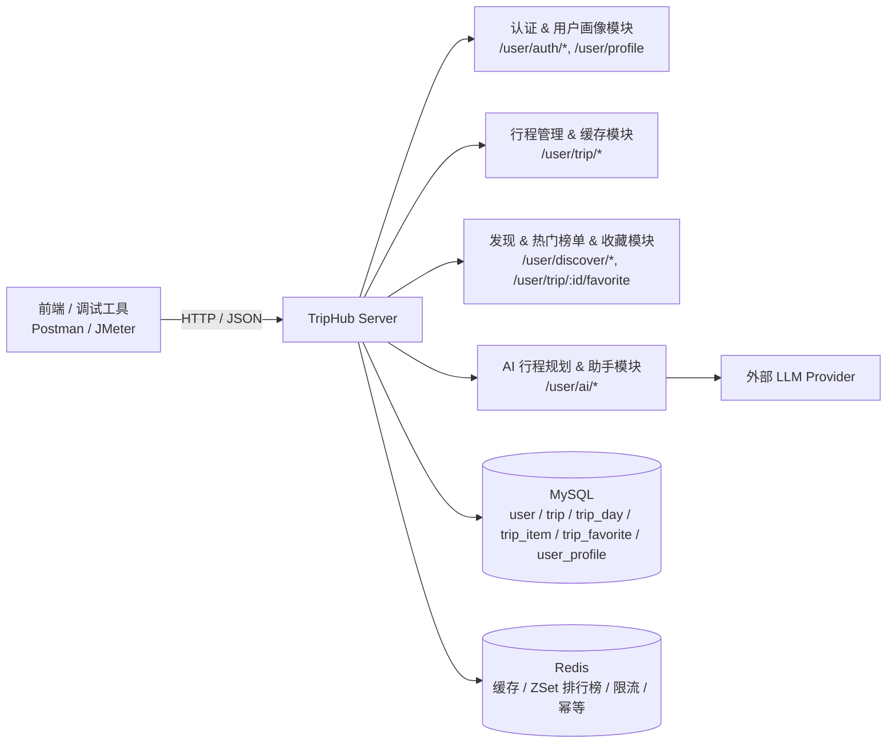
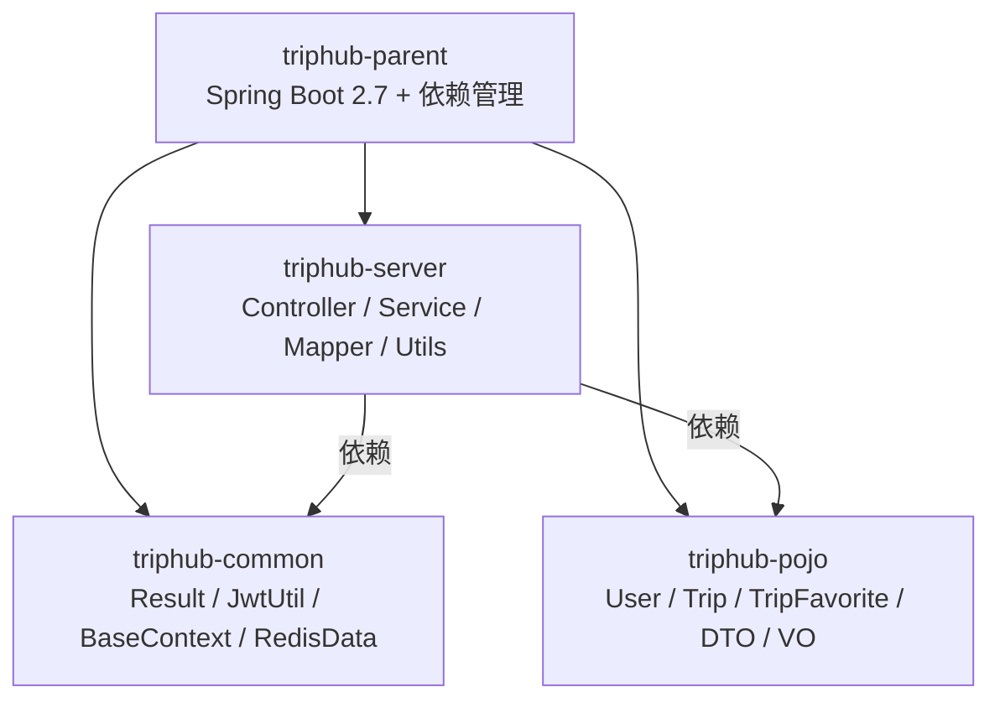

## TripHub 项目介绍

### 一、项目总体概览

- **项目定位**  
  TripHub 是一个面向个人用户的行程管理与旅游玩法 Demo 项目，涵盖：
  - 手机号验证码登录与用户鉴权；
  - 行程创建、按天编辑与缓存优化；
  - 热门行程 / 热门目的地榜单；
  - 行程收藏行为反哺用户画像（统计收藏数量与偏好城市）；
  - 用户画像驱动的 AI 行程规划与助手（RAG 味道的轻量级实践，带限流与幂等保护）。

- **使用场景**  
  适合作为面试作品或学习项目，展示「登录鉴权 + 缓存 + 排行榜 + 收藏画像 + AI 推荐」在一个统一业务域下的组合实现。

### 二、工程模块与目录结构

- **Maven 多模块工程**
  - `triphub-parent`：父工程，统一依赖版本与插件管理（JDK 17、Spring Boot、MyBatis-Plus、Redisson 等）。
  - `triphub-common`：通用基础组件：
    - 统一返回结果：`Result`、`PageResult`
    - 全局异常：`GlobalExceptionHandler`
    - JWT 配置与工具：`JwtProperties`、`JwtUtil`
    - 用户上下文：`BaseContext`
    - Redis / Redisson 基础配置：`RedisConfiguration`、`RedissonConfig`
    - Redis 相关常量：`RedisConstants`
  - `triphub-pojo`：实体、DTO、VO 定义：
    - 实体：`User`、`Trip`、`TripDay`、`TripItem`、`UserProfile`、`TripFavorite` 等
    - DTO / VO：行程按天编辑 DTO、AI 行程请求 DTO、AI 行程返回 VO、推荐行程 VO、AI 助手 DTO 等
  - `triphub-server`：业务服务模块：
    - Controller：用户登录、行程、发现页、收藏、AI 等接口
    - Service / ServiceImpl：业务逻辑实现
    - Mapper：MyBatis-Plus 映射接口
    - Utils：`CacheClient`、`RedisIdWorker`、`AiClient`、`SimpleRateLimiter`、`MetricsRecorder` 等

- **数据库与初始化脚本**
  - 初始化脚本：`db/init_triphub.sql`
  - 核心表：
    - `user`：用户基础信息
    - `trip` / `trip_day` / `trip_item`：行程主表与按天拆分结构
    - `trip_favorite`：行程收藏表，用于反哺用户画像统计
    - `user_profile`：用户画像 JSON 存储

### 三、核心业务功能概览

- **1. 用户认证与画像**
  - 支持手机号 + 验证码登录、JWT 鉴权与当前用户信息查询，保证后续所有接口都能识别「当前用户」。
  - 通过 `user_profile` 表与 `/user/profile` 接口管理用户画像，为 AI 行程规划与个性化推荐提供输入。

- **2. 行程管理与按天编辑**
  - 支持用户创建行程、查看详情、分页查看「我的行程」，并按「Trip / TripDay / TripItem」三层结构管理每天的行程条目。
  - 具体接口与请求示例集中在 `docs/trip/create_trip.md` 与 `docs/trip/day_edit.md` 中说明，本项目介绍不再逐一罗列增删改查 API。

- **3. 行程缓存与热门榜单**
  - 行程详情缓存：
    - 使用 `CacheClient.queryWithLogicalExpire` 实现逻辑过期 + 互斥锁重建，防止缓存击穿。
    - 缓存 Key：`cache:trip:{id}`，结合逻辑过期时间与后台重建线程。
  - 热门行程 / 热门目的地榜单：
    - 热门行程 ZSet：`hot:trip`，member 为 `tripId`，score 为浏览次数。
    - 热门目的地 ZSet：`hot:dest`，member 为目的地城市名。
    - 每次成功访问行程详情时，累加对应 ZSet 分数，用于驱动热门行程与热门目的地榜单。

- **4. 行程收藏与用户画像反哺**
  - 行程收藏：
    - `trip_favorite` 表记录用户对行程的收藏行为（`user_id + trip_id` 唯一），支持重复调用幂等；
    - 收藏/取消收藏时维护 `trip.like_count` 字段，方便列表页展示热度；
  - 画像反哺：
    - 每次收藏变更后，`TripFavoriteServiceImpl` 会扫描该用户的所有收藏记录，统计：
      - `stats.totalTripsFavorited`：总共收藏了多少条行程；
      - `stats.topCitiesByFavorite`：收藏最多的 Top3 目的地城市；
    - 统计结果写回 `user_profile.profile_json.stats`，成为 AI 行程规划与推荐的重要输入信号之一。

- **5. 用户画像 & AI 行程推荐与助手**
  - 画像存储：
    - `user_profile.profile_json` 以 JSON 形式灵活存储标签、预算、时长偏好等，支持画像字段快速演进；
    - `stats` 块中记录收藏相关统计字段，如 `totalTripsFavorited` 和 `topCitiesByFavorite`。
  - AI 行程规划（`POST /user/ai/trip-plan`）：
    - 基于用户画像 + 请求参数（目的地、天数）构造 Trip 草稿，并调用 LLM 生成「为什么这条行程适合你」的解释文案；
    - 在 Prompt 中显式注入：
      - 画像 JSON；
      - 用户最近收藏的行程列表（精简版 JSON），让模型能参考历史行为偏好；
    - 接口内置 **按用户限流 + Idempotency-Key 幂等机制**：
      - 同一用户 60 秒内最多调用 10 次；
      - 若请求头携带 `Idempotency-Key`，则使用 Redis 缓存最近一次结果，防止前端重复点击或网络抖动导致的多次扣费与重复创建。
  - AI 助手编排（`POST /user/ai/assistant`）：
    - 入参带 `type`（如 `plan_trip` / `recommend_trip`）以及可选目的地、天数、自然语言问题；
    - 在 Service 中手工编排多种「工具」：
      - 用户画像；
      - 最近收藏行程列表；
      -（可扩展为热门榜单、历史行程搜索等）；
    - 将这些上下文拼接为统一 Prompt 交给 LLM，输出一段纯中文回答，相当于一个**轻量级的 function calling / 工具编排**实现。

### 四、工程级技术模块与亮点

- **1. 可观测性与监控模块**
  - **请求级 traceId 机制**：
    - 通过 `TraceLoggingFilter` 为每个 HTTP 请求生成或透传 `traceId`（Header：`X-Trace-Id`），并写入 MDC；
    - 在请求开始与结束时统一输出日志，包含：`traceId`、`userId`、HTTP 方法、URI、状态码与耗时，便于一条日志链路追踪完整调用。
  - **用户身份关联日志**：
    - `JwtTokenUserInterceptor` / `JwtTokenAdminInterceptor` 在完成 JWT 解析后，将当前用户/管理员 ID 写入 `BaseContext` 与 MDC（key=`userId`）；
    - 这样 AI 调用等后续业务日志均可自动带上 `traceId + userId` 组合，方便按用户维度排查问题。
  - **关键链路结构化日志**：
    - 在 AI 行程规划接口中，记录「开始 / 结束」两类日志，字段包括：`traceId`、`userId`、目的地、天数、画像主标签、生成行程 ID、是否成功拿到解释文案等。
  - **业务指标与 Micrometer 预留**：
    - 引入 `spring-boot-starter-actuator` 与统一的 `MetricsRecorder` 组件，使用 Micrometer 记录核心 Counter 指标，例如：
      - `triphub.trip.cache{outcome=hit|miss}`：行程详情缓存命中 / 未命中次数；
      - `triphub.hot_ranking.update{type=trip|dest}`：热门行程 / 热门目的地榜单分数更新次数。
    - 当前指标默认使用内存 Registry，即使尚未接入 Prometheus 也不会影响业务；未来只需在配置中启用对应 Registry，即可将这些指标暴露到监控系统。
  - **异常场景强制打点规范**：
    - 通过注释与文档约定：JWT 解析失败、缓存重建异常、AI 调用异常等场景必须打 ERROR/WARN 级日志，并携带 `traceId`、`userId`、关键业务参数；
    - 让项目在排查「缓存不命中原因」「热门榜单未更新」这种问题时，有足够的观测数据支撑分析。

- **2. 接口安全与限流模块**
  - **JWT 鉴权与资源级权限控制**：
    - 通过 `JwtTokenUserInterceptor` / `JwtTokenAdminInterceptor` 统一解析请求头中的 token，将用户/管理员 ID 写入 `BaseContext`，所有 `/user/**` 接口都依赖该上下文做登录态校验；
    - 在行程相关接口中（如 `/user/trip/day/detail`、`/user/trip/item` 系列），显式校验「当前用户是否为行程拥有者」，避免越权访问或非法修改他人行程数据。
  - **基于 Redis 的接口限流实现**：
    - 抽象出 `SimpleRateLimiter` 组件，使用「固定时间窗口 + 自增计数」方式做限流控制，键设计为 `rl:{bizKey}:{identify}`，不引入复杂算法，重点保证简单可靠；
    - 对验证码发送接口 `/user/auth/sendCode`：
      - 按 IP 维度：同一 IP 在 60 秒内最多请求 20 次；
      - 按手机号维度：同一手机号在 1 小时内最多请求 5 次；
      - 超出阈值统一返回 `code = 1`、`msg = "请求过于频繁，请稍后再试"`，有效防止脚本频繁打验证码接口。

- **3. 测试与质量保障模块**
  - 项目内提供完整的 Postman 集合 `triphub-auth.postman_collection.json`，覆盖登录、行程管理、按天编辑、热门榜单、用户画像、AI 推荐等所有核心接口，并通过 Tests 脚本自动写入 `userToken`、`tripId`、`tripItemId` 等变量，形成一套「接口链路自动串联」的端到端测试流。
  - 在 `docs/` 目录下按模块拆分接口说明与测试步骤（auth / trip / discover / ai），与 Postman 用例一一对应，组成结构化的手工测试用例库。

- **4. 工程化与部署支持模块**
  - 配置管理：
    - 使用 `application.yml` + `application-dev.yml` + `application-prod.yml` 配合 `spring.profiles.active` 管理多环境配置；
    - 将 **数据库、Redis、AI Key** 等敏感信息统一抽象为环境变量（如 `TRIPHUB_DB_URL`、`TRIPHUB_REDIS_HOST`、`TRIPHUB_AI_API_KEY` 等），代码中只读取占位符，避免在仓库中硬编码。
  - 初始化脚本：提供 `db/init_triphub.sql`，一键完成核心库表初始化，降低环境搭建成本。
  - 容器化与可上云形态：
    - 为 `triphub-server` 编写了简单的 `Dockerfile`，以打包后的 JAR 为入口，通过环境变量注入 DB / Redis / AI Key；
    - 在仓库根目录提供 `docker-compose.yml`，一次性拉起 **MySQL + Redis + TripHub 应用** 三个容器，并挂载 `db/init_triphub.sql` 自动建库建表。

### 五、技术栈与关键实现点

- **基础技术栈**
  - JDK 17、Spring Boot、Spring MVC
  - MyBatis-Plus（简化 CRUD 与分页）
  - MySQL（业务数据持久化）
  - Redis（缓存、ZSet 排行榜、收藏统计）
  - Redisson（分布式锁）
  - JWT（用户端鉴权）

- **缓存与高并发相关技术点**
  - 逻辑过期缓存：
    - 使用 `RedisData` 包装真实数据与逻辑过期时间；
    - 到期后由后台线程异步重建，前端仍可读到旧数据。
  - 缓存穿透防护：
    - 对不存在的数据写入空值缓存并设置较短 TTL。
  - 排行榜实现：
    - 基于 Redis ZSet 实现热门行程与热门目的地榜单。
  - 全局唯一 ID：
    - `RedisIdWorker`：时间戳 + Redis 自增序列，保证全局有序且不冲突。

- **AI 集成与 RAG 味道实践**
  - 可配置的 AI 调用参数：
    - 通过 `triphub.ai.*` 配置 base-url、api-key、model 等；
  - Prompt 设计：
    - 将用户画像 JSON、收藏行程摘要、目的地、天数等拼接为提示词；
    - 要求大模型输出纯中文解释文本，并说明「为什么推荐这条行程」。
  - 降级与保护策略：
    - 外部 LLM 不可用时，本地拼接一段说明文案，保证接口始终返回成功结果（只是在解释字段上有差异）；
    - 对 `trip-plan`、`assistant` 这类 AI 接口引入按用户限流与 Idempotency-Key 幂等缓存，控制调用频率与成本，提升 SLA。

### 六、架构与模块关系（Mermaid 图）

- **1. 整体系统架构**

- **2. Maven 多模块依赖关系**

